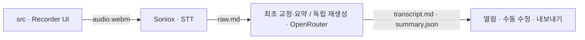

# AI NOTE — 회의 녹음 → 회의록 요약

> 모델·도구 무관 **에이전트 진입점**. Claude Code·Codex 등 어떤 에이전트가 열어도 이 파일을 먼저 읽는다. `CLAUDE.md`는 이 파일의 심링크(내용 하나). 사람 온보딩은 [README.md](README.md).

승인형 고객 계정을 갖춘 회의 웹앱. 마이크 녹음 → Soniox 클라우드 전사 → OpenRouter 작업별 모델 라우팅 교정·요약 → 열람·내보내기. 상세 기획은 [docs/PRD.md](docs/PRD.md), 계약·데이터흐름은 [docs/ARCHITECTURE.md](docs/ARCHITECTURE.md), 디자인은 [docs/UI_GUIDE.md](docs/UI_GUIDE.md).

## 데이터 흐름 · Dependencies (cross-module)



- 흐름: `src`(녹음/API) → Soniox 비동기 또는 실시간 전사 → OpenRouter 교정·요약·번역 → 열람·수동 수정·내보내기. 단일 writer 소유권은 아래 CRITICAL 참조.
- 모듈별 상세: [src/CLAUDE.md](src/CLAUDE.md) · [scripts/CLAUDE.md](scripts/CLAUDE.md).
- 결정 기록(ADR): [docs/decisions/](docs/decisions/) · AI 기능 품질: [evals/](evals/).

## 기술 스택
- Next.js 15 (App Router) · TypeScript strict · Tailwind CSS
- 전사: Soniox `stt-async-v5`와 `stt-rt-v5`; 생성형 AI: OpenRouter 작업별 저비용 모델 체인
- 테스트: Vitest(+ RTL/jsdom component test) + 고정 버전 Playwright/Chromium synthetic browser 회귀. Chrome DevTools MCP는 선택적 정성 검토 전용이며 자동 gate가 아니다(ADR 0020).
- 저장: 로컬 파일(계정별 `data/tenants/{sha256}/meetings/{id}/`, 레거시 단일 사용자 루트는 `data/meetings/{id}/`) — DB 없음.

## 설치 (Installation)

> 사람 대상 요약은 `README.md`. 아래 계약은 에이전트가 이 저장소의 공개 문서를 읽은 시점부터 적용된다. 저장소를 clone하기 전 agent host의 정책까지 이 저장소가 강제한다고 주장하지 않는다.

### 저장소 URL만 받은 에이전트

1. 먼저 설치 target을 absolute path로 결정하고 사용자에게 알린다.
   - 사용자가 target을 명시하지 않았으면 현재 디렉터리 자체에 설치하지 않는다. 현재 위치가 다른 Git 저장소 안이면 그 저장소 root의 sibling `ai-note`를, 아니면 현재 디렉터리 아래의 새 `ai-note`를 선택한다.
   - 기본 이름이 이미 있으면 재사용·덮어쓰기·`pull`하지 않는다. `ai-note-2`, `ai-note-3`처럼 첫 번째 비어 있는 deterministic suffix path를 선택한다.
   - 사용자가 명시한 target이 non-empty이거나 이미 다른 origin을 가리키면 중단하고 exact absolute path를 보고한다.
2. Clone과 이후 설치는 선택한 target 안에서만 수행한다. 상위 `.git`·`.claude`·`.harness`, 사용자 Git 설정, 다른 `package.json`, 실행 중인 프로젝트를 수정하거나 종료하지 않는다.
3. 단순 경로 충돌은 안전한 새 suffix target으로 해결한다. OS package 설치의 `sudo`/확인이나 provider 로그인처럼 새 권한이 필요한 경우에만 사용자 승인을 요청한다.

### Clone 뒤 정본 실행

1. **Node ≥ 20 확보** — `node -v`. 없거나 낮으면 nvm 또는 OS package manager 설치 명령을 사용자에게 보여 주고 필요한 권한을 받는다.
2. Target root에서 `npm ci`, `cp .env.example .env.local`을 실행하고 사용자가 발급한 `SONIOX_API_KEY`와 `OPENROUTER_API_KEY`를 입력한다.
3. `npm run setup`으로 Node·ffmpeg를 확인하고 `npm run dev`로 로컬 실행한다. 고객 테스트 배포는 [docs/AWS_DEPLOYMENT.md](docs/AWS_DEPLOYMENT.md)를 따른다.
4. 성공 시 로컬은 `http://127.0.0.1:3000`, 배포는 터널이 출력한 정확한 HTTPS 주소를 사용한다. 최종 handoff에는 absolute install path, branch 또는 revision, 실제 앱 URL을 함께 보고한다.

로컬 앱은 `127.0.0.1:3000`에만 바인딩한다. 클라우드 컨테이너는 내부 `0.0.0.0:3000`에서 실행하되 외부에는 HTTPS 터널만 노출한다. `.env.local`·`.env.production`을 만들거나 덮어쓸 때는 사용자 키를 보존한다.

## 아키텍처 규칙

### CRITICAL — 반드시 지킬 것
- **TDD**: 새 기능은 테스트 먼저 작성 → 통과하는 구현.
- **원본 불가침**: `audio.webm`·`raw.md`·`segments.json`은 생성 후 수정 금지. `transcript.md`·`summary.json`만 재생성·수동 수정 가능한 파생물이다.
- **원자적·내구 쓰기**: 모든 아티팩트는 temp 파일 → file `fsync` → `rename` → parent-directory `fsync`로 쓴다. `rename`이 논리적 commit 지점이며 결과는 `not_committed | committed_durable | committed_best_effort | committed_durability_pending`으로 구분한다. rename 뒤 sync 실패를 rollback하거나 미커밋으로 오인하지 않는다(ADR 0011).
- **계정별 데이터 루트**: 고객 데이터는 `data/tenants/{sha256(accountId)}` 아래에만 쓴다. 계정은 세션 쿠키에서만 결정하고(`middleware.ts`가 주입한 `x-vision-account-id`), 스트리밍 `finalize`는 헤더를 무시하고 세션을 재조회해 `runWithAccountTenantData()` 안에서 실행한다. 새 route/worker는 `dataRoot()`·`meetingPaths()`만 사용하고 `process.cwd()/data`를 직접 조합하지 않는다. `data/settings.json`·`data/system/`만 서버 전역이다.
- **파일 소유권(단일 writer)**: `status.json`=app-api만, `data/library.json`=library repository만, `raw.md`/`segments.json`=Soniox 전사 publisher만, `transcript.md`/`summary.json`=app summarize publisher만, `meeting-tombstones/`=app lifecycle만. 남의 파일을 쓰지 않는다. Workspace/folder/placement는 중앙 registry metadata이며 `data/meetings/{id}/` 경로는 이동하지 않는다. 사용자 지정 제목은 `status.json.titleOverride`, 참석자는 `status.json.review`의 전용 app-api surface가 소유하며 summary editor가 `title`/`topicSlug`/`summary.participants`를 수정하지 않는다(ADR 0008, 0021, 0022).
- **영구 삭제 fence**: 회의 삭제는 `meeting-tombstones/{id}.json` durable rename을 logical commit으로 삼는다. Tombstone은 live directory보다 우선하며 모든 reader/writer/worker/scanner가 재생성을 fail-closed해야 한다. Malformed/unreadable/symlink marker는 임의 복구하지 말 것. Placement·deterministic trash·late producer orphan은 operation→artifact write lease 순서의 lazy sweep으로 정리하고 tombstone은 영구 보존한다(ADR 0015).
- **원자 finalize**: request body 전에 hidden `.finalize-{id}` intent를 durable create-exclusive하고, audio+initial status+immutable receipt를 staging에서 완성한 뒤 directory rename으로 publish한다. Published same-ID retry는 body를 읽거나 `audio.webm`을 덮지 않고 receipt 기반 probe/recovery를 수행한다. Placement pending/unavailable은 generic default reconcile에서 defer하며 post-publish remux·placement·dispatch 실패는 artifact commit을 되돌리지 않는다(ADR 0016).
- **편집 가능한 파생 pair 발행**: API/UI/adapter는 canonical `transcript.md`/`summary.json`을 직접 쓰지 않고 `summarizePublisher`만 두 파일을 함께 발행한다. 최초 생성만 불변 `raw.md` 교정 뒤 그 결과로 요약한다. 이후 `transcript_regenerate`는 `raw.md` 교정만 실행해 기존 summary를 보존하고, `summary_regenerate`는 현재 canonical transcript만 사용해 summary만 만든다. 수동 transcript/summary 저장도 반대편 artifact를 그대로 포함한 full-pair payload를 발행한다. Transcript 변경은 summary를 자동 생성하지 않고 `summaryOutdated`를 파생시키며, summary 수동 저장·재생성만 현재 transcript 기준 fresh 상태를 만든다. Adapter/202 또는 수동 발행 전 durable `summarizeAttempt`를 commit하고 `summary.json`을 completion marker로 마지막 발행한다. Pair consumer는 artifact read lease, publisher/delete/cleanup은 write lease를 사용하며 lock 순서 `meeting operation → artifact RW → status queue → library queue`를 거슬러 획득하지 말 것(ADR 0013, 0021).
- **자유 본문 요약 계약**: Generated summary는 기존 structured shape로 읽고, 수동 저장한 summary는 optional `body` 하나를 current editable truth로 쓴다. `body`가 있으면 `oneLine`/`purpose`와 모든 structured editable list/action item은 비어 있어야 하며 dual truth를 schema에서 거부한다. Body는 CRLF만 LF로 정규화하고 trim/heading parse/action-item 추론을 하지 않는다. Copy·Markdown/JSON·knowledge/search/chat evidence는 body를 사용하되 outdated summary에는 fresh semantic credit을 주지 않는다. 선택 tab의 local action bar는 tablist 직후, warning과 읽기 본문 또는 이를 교체한 single textarea 앞에 둔다(ADR 0022).
- **Library 직렬화**: `library.json`의 bootstrap/reconcile/mutation은 absolute canonical path 기준 process-global queue에서만 수행한다. Public mutation token은 `libraryId + revision`; durability pending 동안 후속 mutation은 fail-closed한다. 손상·상위 버전·I/O 오류 registry를 자동 bootstrap/sanitize하지 않는다.
- **Library 복구**: corrupt에서만 latest fingerprint를 요구하는 명시적 rebuild를 허용한다(ADR 0017). `libraryRecoveryPlanner`의 action을 같은 library queue 안에서 실행하고 original→private archive→new canonical 순서와 양쪽 namespace sync를 지킨다. Intent phase는 atomic replace하며 active marker를 truncate하지 않는다. Unsupported/I/O/conflict를 rebuild로 낮추지 말고 archive는 자동 삭제하지 않는다. 새 `libraryId` 수용 시 client generation epoch를 올려 old poll/mutation/page/dialog/source URL을 전부 폐기한다.
- **앱은 API 키를 저장하지 않는다**: `SONIOX_API_KEY`와 `OPENROUTER_API_KEY`는 서버 환경 변수에서 지연 로드하고 앱 데이터·응답·로그에 저장하거나 노출하지 않는다. 브라우저 실시간 전사는 60초 single-use Soniox 임시 키만 사용한다. OpenRouter 요청은 zero-retention과 data-collection deny를 요구한다.
- **build-green**: `next build`가 시크릿/DB/env 없이 매번 통과해야 한다. `data/`를 읽는 라우트·페이지는 `export const dynamic='force-dynamic'` + `cache:'no-store'`; top-level `process.env` 접근 금지(핸들러 내 지연); `data/`가 없어도 견디게; MediaRecorder/Web Audio 코드는 `"use client"`; 라우트는 Node 런타임(edge 금지).
- **바인딩**: 로컬 서버는 로컬 인터페이스만. 클라우드 앱 포트는 Docker 네트워크와 loopback health check에만 노출하고 외부 접속은 HTTPS 터널로 제한한다.
- **로컬 요청 경계**: 모든 data API와 data-reading RSC는 params/body/fs/network/spawn보다 먼저 공통 guard를 통과한다. Raw Host는 exact `127.0.0.1|localhost`, unsafe method Origin은 request origin과 exact match, Fetch Metadata는 same-origin만 허용(API에서 `none` 금지). JSON은 exact content type + raw byte cap이며 public DTO/error는 path·job/dispatch ID·raw provider/fs output을 노출하지 않는다.
- **외부 서비스 경계**: Ollama egress는 explicit-port loopback만 허용한다. Soniox/OpenRouter HTTPS 호출은 redirect 금지와 timeout을 강제하고 provider 응답 본문을 public error에 포함하지 않는다.
- **전사 dispatch/completion**: app은 Soniox 호출 전 `status.transcriptionDispatch` proposed ID를 durable commit한다. 원격 file/transcription ID를 저장해 재시작 후 resume하고 `segments.json` 먼저, `raw.md` 마지막 순서로 발행한 뒤 원격 리소스를 정리한다.
- **클라우드 데이터 취급**: `data/`·glossary는 gitignored이며 오디오·전사·요약·단어장은 PII를 포함할 수 있다. Soniox에는 전사를 위해 오디오가, OpenRouter에는 교정·요약·질문·번역 문맥이 전송된다. 현재 배포는 한 고객사 테스트 인스턴스로 제한한다.
- **Synthetic browser QA 경계**: 반복 가능 UI gate는 repository-owned Playwright command만 사용한다. `data/`·glossary·`.env*`·실제 외부 network를 사용하지 않고 runner-owned 임시 snapshot과 FAKE 서비스를 쓴다. 성공 screenshot/assertion/console manifest는 `test-results/` 또는 execute local journal에만 두며 Git에 커밋하지 않는다(ADR 0020).

### 일반 규칙
- 컴포넌트는 `src/components/`, 타입은 `src/types/`(또는 `src/domain/`), 유틸은 `src/lib/`, 외부 래퍼는 `src/services/`.
- 커밋 메시지는 conventional commits(feat:, fix:, docs:, refactor:, chore:).

## 개발 프로세스
- 실제 전사·외부 모델 호출은 **런타임에만**. 테스트·스모크는 FAKE 스텁으로.
- Playwright/Chromium 갱신은 `package.json`의 exact version을 의도적으로 바꾼 뒤 browser 재설치 → doctor → 전체 E2E 순서로만 한다. 앱/Next 변경 때마다 Chrome DevTools MCP를 갱신하거나 별도 adapter를 보수하지 않는다.

## 명령어
```bash
npm run setup       # Node·ffmpeg와 환경 파일 안내 점검
npm run dev         # contributor용 foreground Next 개발 서버
npm run start:cloud # Docker/HTTPS 프록시 뒤 클라우드 실행
npm run build       # 프로덕션 빌드 (시크릿 없이 통과해야 함)
npm run lint        # ESLint
npm test            # vitest run (+ component test), watch 금지
npm run test:e2e:install # 최초 1회: 고정 Playwright 버전의 Chromium 설치
npm run test:e2e:doctor  # 읽기 전용: Node/package/browser 정합 확인
npm run test:e2e     # synthetic snapshot의 Chromium 3-viewport 회귀
npm run typecheck   # tsc --noEmit
npm run check:links # docs/context 마크다운 죽은 링크 0
```
