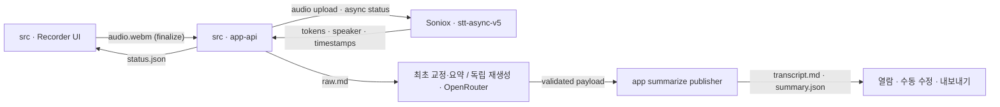

# 아키텍처 & 계약 (정본)

이 문서는 모든 build step에 주입되는 **유일한 교차-step 계약 채널**이다. 각 step은 격리 세션이므로 여기 적힌 shape/경로/enum을 그대로 따른다.

## 디렉토리 구조
```
src/
├── app/               # Next.js 페이지 + API 라우트 핸들러(Node runtime)
├── components/        # UI 컴포넌트
├── domain/            # 순수 타입/FSM/스키마 (의존 없음)
├── lib/               # atomic-write, id 검증, 파일 IO 유틸
└── services/          # Soniox·OpenRouter 등 외부 서비스 래퍼
scripts/               # setup + check-links + isolated E2E harness
e2e/                   # synthetic Playwright scenario + evidence reporter
playwright.config.ts   # Chromium 3-viewport, isolated webServer 계약
.claude/commands/      # meeting-summarize.md
data/meetings/{id}/    # 런타임 산출물(gitignore, fixtures 제외)
data/meetings/{id}/knowledge-card.json # meeting별 재생성 가능한 검색 파생물
data/meeting-tombstones/{id}.json # 영구 ID delete fence(app lifecycle writer)
data/library.json      # workspace/folder/placement 중앙 registry(app-api 단일 writer)
data/user-profile.json # optional 개인화 프로필(app-api 단일 writer, LLM settings와 분리)
data/knowledge/corpus-map.json # bounded 전체 검색 후보 projection
fixtures/              # 테스트 픽스처(커밋): raw.md, summary happy/fallback
```

## Synthetic browser QA 경계

반복 가능한 시각/상호작용 gate의 정본은 `npm run test:e2e`다. `run-e2e.mjs`가 매 실행마다 loopback port와 OS temp snapshot을 소유하고, snapshot에는 allowlist된 `src/`(비활성 worker entrypoint 제외)·`public/`·build metadata와 새 empty `data/`만 복사한다. `node_modules`는 dependency root로만 연결하며 `data/`, `glossary.json`, `.env*`, Git metadata와 runtime 산출물은 복사하지 않는다. App child는 synthetic `HOME`, scrubbed env, `AI_NOTE_DISABLE_WORKER=1`, fake provider로 실행돼 실제 Soniox/OpenRouter/로컬 CLI에 닿지 않는다. 서버 bind는 `127.0.0.1`; Next 15 Route Handler authority와 local Host guard를 일치시키기 위해 browser URL만 동등한 loopback 이름 `localhost`를 쓴다.

`e2e/support/synthetic-test.ts`가 각 scenario의 성공 screenshot, console error, 외부 browser request를 자동 수집한다. Reporter는 desktop-1440/mobile-390/mobile-320 coverage, assertion pass, console error 0, external network 0, SHA-256/byte size를 가진 `manifest.json`을 생성한다. 평상시 산출물은 gitignored `test-results/`, `/execute`에서는 runner-owned Git local journal만 사용한다. Chrome DevTools MCP는 existing Chrome session이 필요한 정성 탐색에만 선택적으로 사용하며 이 gate나 evidence를 대체하지 않는다. 상세 결정은 ADR [0020](decisions/0020-deterministic-synthetic-browser-verification.md)을 따른다.

## 로컬·클라우드 runtime

- Clone 뒤 `npm ci`와 `.env.example` 복사, `npm run setup`, `npm run dev`가 로컬 정본이다. Setup은 Node·ffmpeg를 검사하고 provider 키 파일을 안내한다. Python·`uv`·로컬 STT 모델은 필요하지 않다.
- 로컬 Next 서버는 `127.0.0.1`에만 bind한다. 고객 테스트는 multi-stage Docker 이미지에서 non-root 사용자로 실행하고 host의 `127.0.0.1:3000`에만 publish한다.
- 외부 접속은 Cloudflare Tunnel이다. 기본은 Quick Tunnel의 임시 HTTPS origin이고, 고정 도메인은 이름 있는 터널(`CLOUDFLARE_TUNNEL_ARGS="run <name>"`, 자격증명은 `ai-note-cloudflared` 볼륨)로 붙이며 `APP_ORIGIN`을 정확한 HTTPS origin으로 고정한다(docs/AWS_DEPLOYMENT.md §8).
- `SONIOX_API_KEY`, `OPENROUTER_API_KEY`, `AI_NOTE_SMTP_PASSWORD` 등 외부 자격증명은 gitignored 환경 파일에서만 주입하고 build 시점에는 요구하지 않는다. 비밀번호 복구 메일은 `AI_NOTE_SMTP_*`를 핸들러 안에서 지연 로드하고 TLS 1.2 이상 SMTP만 허용한다. 테스트는 fake provider·fake mail만 사용한다.
- 승인된 고객 계정마다 데이터 루트를 `data/tenants/{sha256(accountId)}`로 분리한다(아래 "계정별 데이터 루트"). 파일 기반 단일 서버는 고객 테스트용이며 상용 멀티테넌시가 아니다(ADR 0026). Soniox/OpenRouter 전환은 ADR [0027](decisions/0027-soniox-transcription-and-openrouter-routing.md)을 따른다.

## 계정별 데이터 루트 (tenant data root)

- `dataRoot()`는 요청별 `AsyncLocalStorage` 컨텍스트의 테넌트 루트를 우선하고, 컨텍스트가 없을 때만 레거시 `data/`를 돌려준다(`src/lib/tenantDataContext.ts`, `src/lib/paths.ts`). 회의·`library.json`·`glossary.json`·`user-profile.json`·`knowledge/`·`meeting-tombstones/`는 모두 이 루트 아래에 있다. `data/settings.json`(요약 모델 설정, 비밀 없음)과 `data/system/`(계정·세션·사용량·감사)만 서버 전역이다.
- 계정 식별의 유일한 근거는 세션 쿠키다. `middleware.ts`가 세션에서 `x-vision-account-id`를 **덮어써** 주입하고 `guardLocalApiRequest()`가 그 값으로 컨텍스트를 연다. 스트리밍 업로드인 `POST /api/meetings/{id}/finalize`만 middleware가 헤더를 건드리지 않으므로 guard는 이 경로에서 헤더를 무시하고, route가 세션을 다시 조회해 `runWithAccountTenantData()` 안에서 전체 처리를 실행한다. 세션 없이 계정 헤더만 온 finalize 요청은 401이다. 세션도 헤더도 없는 non-cloud 직접 호출(단위 테스트)만 레거시 루트를 쓴다.
- 백그라운드 요약 워커는 `data/tenants/*`를 순회하며 각 루트를 자신의 컨텍스트로 감싸 실행하고, 테넌트가 하나라도 있으면 레거시 `data/meetings`는 더 이상 자동 요약하지 않는다. 전사 모니터는 dispatch를 시작한 요청 컨텍스트를 그대로 상속한다.
- 회귀: `src/app/api/__tests__/finalizeTenantBoundary.test.ts`, `src/lib/__tests__/localRequestGuard.test.ts`(account identity header), `src/lib/__tests__/summarizeWorkerTenants.test.ts`, `src/lib/__tests__/tenantDataContext.test.ts`.

## 프로세스 & 데이터 흐름

고객 비밀번호 복구는 `POST /api/auth/password/forgot`이 enumeration-safe 응답과 이메일별 rate limit을 적용한 뒤 `auth.json` 계정에 임시 비밀번호의 scrypt hash·request ID·30분 만료만 원자적으로 기록하고 SMTP로 평문을 한 번 전달한다. SMTP 실패 시 matching request ID만 취소하며 기존 영구 비밀번호는 유지한다. 임시 비밀번호를 실제 로그인에 사용한 순간 hash를 소비하고 `passwordChangeRequired`를 세운다. Middleware는 `/password/change`, 해당 API, 로그아웃·세션 확인 외의 고객 제품/API를 fail-closed하고, 새 비밀번호 변경은 모든 기존 고객 세션을 폐기한 뒤 새 세션을 발급한다. 응답·로그·파일에는 임시 비밀번호 평문과 SMTP 자격증명을 남기지 않는다.
```
브라우저(녹음, 오디오만·메모리 버퍼) ─stop─▶ POST /api/meetings/{id}/finalize(바이너리 스트림)
  app-api: durable intent → hidden audio+status+receipt → directory publish → remux/placement/전사 독립 처리
app-api ─upload/create/status/transcript─▶ Soniox stt-async-v5
  app-api: 원격 ID 영속화 → 재시작 후 resume → segments.json 먼저, raw.md 마지막 발행 → 원격 리소스 정리
콘텐츠 coordinator(OpenRouter) {initial|transcript_regenerate|summary_regenerate}: intent별 입력 → 작업별 모델 체인 → staging payload → app publisher → transcript.md + summary.json
```



## 파일 소유권 (단일 writer)
| 파일 | writer | 비고 |
|------|--------|------|
| `status.json` | **app-api만** | 생명주기 + `review` + `titleOverride`. `summarized`는 `summary.json` 존재로 파생 |
| `audio.webm` / `play.webm` | app finalize publisher | 원본 불변 / 리먹스 |
| `.finalize-receipt.json` | app finalize publisher | immutable metadata/location/audio identity; same-ID probe source |
| `raw.md` + `segments.json` | Soniox 전사 publisher | 원본 불변 |
| `transcript.md` + `summary.json` | **app summarize publisher만** | API/UI/adapter 직접 쓰기 금지. 수동 저장·독립 재생성도 full pair로 발행하며 `summary.json`이 completion marker |
| `data/library.json` | **library repository만** | workspace/folder/placement metadata. Meeting directory는 이동하지 않음 |
| `data/user-profile.json` | **profile settings app-api만** | optional 표시 이름/별칭/시간 기준. `data/settings.json` LLM provider 설정과 분리 |
| `.whisper-dispatch.json` | legacy 호환 reader | 과거 로컬 전사 publication claim. 신규 Soniox dispatch는 `status.json`이 정본 |
| `meeting-tombstones/{id}.json` | **app lifecycle만** | 영구 logical-delete fence. 물리 cleanup 후에도 보존 |
| `data/meetings/{id}/knowledge-card.json` | knowledge index repository | meeting별 검색 파생물. source summary/transcript SHA-256 포함, 삭제 후 재생성 가능 |
| `data/knowledge/corpus-map.json` | knowledge index repository | card의 bounded summary projection만 모은 전체 검색 파생물, 삭제 후 재생성 가능 |
| `room.json` + `room-events.jsonl` | **room store만** | 통역 회의실 메타·이벤트 로그(ADR 0028). 종료 후 pair는 summarize publisher가 발행 |
| `summary.{lang}.md` | room export | 게스트가 고른 언어의 회의록 번역 캐시. 재생성 가능 |
| `data/system/room-access.json` | **guest session store만** | 초대 토큰 해시 인덱스와 게스트 세션(전역) |

## 회의 지식 인덱스 계약

`knowledge-card.json` v1은 `meetingId`, `sourceHashes.summary/transcript`, summary content, action-item search metadata, `reviewParticipants`, `mentionedPeople`을 가진다. Summary content의 optional `body`는 additive라 기존 body 없는 v1 bytes도 그대로 읽는다. Manual body card는 `body`를 그대로 담고 structured semantic field와 `actionItems`를 빈 상태로 유지하며 body text에서 owner·due·participant를 추론하지 않는다. `reviewParticipants`는 생성 당시 `status.review` snapshot일 뿐이며 v1 `mentionedPeople`은 placeholder가 아닌 structured action item owner 같은 deterministic source만 사용한다. transcript/summary SHA-256은 한 artifact lease 안에서 한 번 읽은 in-memory byte pair로 계산한다. `corpus-map.json` v1은 card의 bounded `meetingId`/one-line/purpose/highlights/mentioned-people와 optional body projection을 포함한다. Body projection은 Unicode character 기준 4,000자로 제한하며 전체 transcript, absolute path, title/status/location/review snapshot을 포함하지 않는다. 내부 read mode는 `missing|ready|stale|corrupt|io_error`, public aggregate는 `ready|partial|unavailable`과 safe reason `missing|stale|corrupt|io_error`만 노출한다.

Card write는 caller의 meeting operation owner 아래 `safe meeting ID → tombstone fence → artifact write lease → tombstone 재확인 → status와 source pair read → atomic replace` 순서를 따른다. Corrupt/unreadable status, deleted/ambiguous tombstone, unsafe record, missing/malformed/ambiguous pair는 live card로 복구하지 않고 fail-closed한다. Rename이 card/corpus의 logical commit이며 parent sync가 일시 실패한 `pending`도 committed 결과로 유지하고 rollback이나 blind rewrite를 하지 않는다.

최초 생성, summary-only 재생성, summary 직접 저장처럼 **fresh summary**를 만든 경로는 app publisher가 `summary.json` completion marker와 matching `summarizeAttempt` 정리를 commit한 뒤에만 별도의 knowledge repository 호출로 card와 corpus 갱신을 시도한다. Transcript-only 재생성·직접 저장은 기존 summary를 보존하고 outdated일 수 있으므로 index refresh를 실행하지 않는다. Publisher 결과와 index 결과는 독립적이다. Index의 missing/stale/corrupt/I/O 실패나 post-rename `pending`은 이미 발행된 transcript/summary pair와 `summarized` status를 rollback·실패 전이시키지 않으며, raw 오류 대신 bounded safe log와 다음 read의 index 상태로만 남는다. 그 밖의 corpus 갱신 trigger는 명시적 `POST /api/knowledge/reindex`뿐이다.

`data/knowledge/` 최초 생성은 data root와 새 entry가 실제 non-symlink directory인지 확인하고 `data/` namespace를 sync한다. 알려진 directory-sync 미지원은 `best_effort`, 지원 환경의 일시 실패는 `pending`으로 구분한다. Corpus write는 absolute canonical `corpus-map.json` path process queue에서 직렬화한다. Rebuild는 common meeting classifier의 `live` record만 대상으로 library/classification snapshot과 meeting별 tombstone/artifact-read-lease card snapshot을 queue 밖에서 수집한다. 모든 per-meeting lease를 놓은 뒤에만 corpus queue를 잡아 latest bounded map을 atomic replace하므로 artifact/library lease와 corpus queue를 중첩하지 않는다.

`POST /api/knowledge/reindex`는 strict `{scope:"all"}` 또는 `{scope:"meeting",meetingId}`만 8 KiB JSON으로 받으며 local guard를 body와 filesystem보다 먼저 적용한다. 명시적 reindex 요청은 canonical corpus path에 대응하는 repository reindex queue에서 동기 직렬화하고 background job/stream을 만들지 않는다. All scope는 common classifier 결과의 live meeting만 operation→artifact-write 순서로 card를 갱신하고 tombstoned/corrupt/unreadable/unsafe record는 fail-closed count로만 집계한 뒤, 모든 meeting operation/artifact lease를 놓고 corpus snapshot을 commit한다. Public DTO는 `status:ready|partial|unavailable`, ordered safe `reasons:missing|stale|corrupt|io_error`, bounded `total/indexed/skipped` count와 `durability:durable|best_effort|pending|null`만 반환하며 path, raw filesystem error, provider/attempt ID는 포함하지 않는다.

Library/classification snapshot과 card snapshot 사이의 최신성 경쟁은 허용하되 commit sequence가 더 새 corpus commit을 이전 snapshot으로 덮지 못하게 한다. `summary-work` read, library read/queue, per-meeting artifact lease, corpus queue는 중첩하지 않고 `snapshot → lease/queue release → corpus commit` 순서를 지킨다. Snapshot 뒤 title/review/location/delete가 바뀔 수 있으므로 corpus를 current truth로 간주하지 않으며 public consumer가 응답 직전 live join과 tombstone fence를 다시 수행한다.

인덱스의 title/status/location/reviewParticipants 같은 mutable metadata snapshot은 public current truth가 아니다. Public projection은 persisted semantic fields만 선택하고 title/status/location/reviewParticipants를 query-time live status/library 입력에서 별도로 결합하며, 응답 직전 tombstone을 재검증한다. Title/review/move/delete lifecycle route에는 corpus fan-out hook을 추가하지 않는다. 챗봇은 검색·회의 조회 도구를 호출하며 서버 evidence ledger가 claim-level citation provenance를 검증한다. 모델은 번호/title/link를 만들지 않고 서버가 실제 인용된 validated meeting ID에 첫 등장 순서 stable 번호와 app-relative link를 부여한다. 상세 결정은 ADR [0018](decisions/0018-meeting-knowledge-index-and-chatbot.md)을 따른다. 챗봇 UI 진입점은 현재 dormant이며(ADR [0019](decisions/0019-meeting-assistant-dormant.md)) 이 인덱스 계약과 라우트는 보존된다.

### AI 없는 단순 검색 계약

`GET /api/search`는 Node dynamic route이며 local guard를 URL query 해석과 filesystem/repository read보다 먼저 실행한다. Query는 500자 이하이고 NFKC→locale-independent lower-case→separator-to-space→whitespace collapse 순서로 정규화한다. `+`, `#`, `.`, `_`, `-`는 word character와 닿은 run만 보존해 `C++`, `C#`, `v2.1`, `ai-note`를 한 token으로 유지한다. 공백 token은 모든 token이 title/topic/one-line/highlights/discussion/decisions/action-items/risks/followups/current participants 또는 current metadata field 중 적어도 하나와 substring 일치해야 하는 AND 조건이다.

Date/workspace/folder/status/action-item filter는 score 계산 전에 적용한다. Ranking은 `src/lib/meetingSearch.ts`의 명시적 field-weight table과 exact-phrase bonus가 정본이며, 동점은 `startedAt` 최신순 → meeting ID 영문 오름차순이다. Public match reason은 상위 3개의 user-facing field label과 query 주변 180자 이하 plain-text excerpt만 포함하고 HTML/Markdown, score, absolute path, raw filesystem/provider output을 포함하지 않는다. `mentionedPeople`은 action-item owner처럼 결정적으로 만든 hint일 뿐 임의 인명 인식 결과로 설명하지 않는다.

기본 검색 source는 `corpus-map.json`과 `knowledge-card.json`이며 `transcript.md` 전체를 매 요청마다 읽지 않는다. Search card freshness는 canonical pair의 completion marker인 current `summary.json` 해시, current `summarizeAttempt`, `contentRevision` pair hash와 `basedOnTranscriptSha256`를 함께 사용한다. Pair publisher가 transcript와 summary를 한 generation으로 발행하고 summary를 마지막에 commit한다는 계약에 의존한다. Ready이면서 summary가 current transcript 기준 fresh인 card만 semantic field를 제공한다. Manual `body`는 고정 weight 85의 `회의록 본문` field로 정규화·랭킹하고 plain-text deterministic excerpt를 반환한다. `hasActionItem` filter는 structured `actionItems`의 존재만 보며 body text를 parse하지 않는다. Outdated/stale/missing/corrupt card는 본문을 제공하지 않지만 current live title/date/status/location/review participants는 검색할 수 있고 aggregate는 `partial`이다. Corpus 자체가 missing/corrupt/I/O로 읽히지 않으면 `unavailable`이며 결과를 반환하지 않는다.

검색은 library/classified-status snapshot에서 후보를 만들고 card를 읽은 뒤 current library/status snapshot을 다시 읽는다. 두 snapshot의 `libraryId+revision`이 다르면 혼합 generation을 반환하지 않고 no-store `409 {error:{code:"search_retry",message}}`로 낮춘다. Public result 직전 current classifier와 tombstone을 다시 확인해 tombstoned/ambiguous/unsafe/corrupt/missing-status meeting을 제외하고 title/status/location/review participants는 반드시 마지막 live snapshot에서 투영한다.

성공 DTO는 다음 bounded shape다. `limit` 기본값은 20, 최대 50이며 cursor pagination 없이 limit 밖 valid result 존재만 `hasMore`로 알린다. `summaryPendingCount`는 semantic card를 아직 사용할 수 없는 요약 대기 상태를 UI가 구분하기 위한 bounded count다.

```ts
{
  query: string;
  results: Array<{
    meetingId: string;
    title: string;
    status: MeetingStatus;
    startedAt: string;
    location: { workspaceId: string; folderId: string | null; breadcrumb: string[] } | null;
    matches: Array<{ field: string; label: string; excerpt: string }>;
    href: `/meetings/${string}`;
  }>;
  hasMore: boolean;
  summaryPendingCount: number;
  index: {
    status: "ready" | "partial" | "unavailable";
    reasons: Array<"missing" | "stale" | "corrupt" | "io_error">;
    reindexable: boolean;
  };
}
```

### 전체 회의 챗봇 tool protocol

> **현재 dormant(ADR [0019](decisions/0019-meeting-assistant-dormant.md)):** 우측 `회의 도우미` UI 진입점은 build-time flag `MEETING_ASSISTANT_ENABLED`(기본 `false`)로 차단돼 사용자에게 노출되지 않는다. 아래 `POST /api/chat` tool protocol·budget·evidence ledger 계약과 라우트·오케스트레이터·테스트·공유 지식 인덱스는 **그대로 보존**한다(삭제 아님). 되살리는 법은 flag를 `true`로. 0018의 서버 계약은 유효하며 UI만 gated다.

`POST /api/chat`는 Node dynamic·non-streaming route다. Local request guard를 body read, 설정 조회, filesystem, adapter 실행보다 먼저 적용하고 exact JSON을 128 KiB에서 제한한다. 요청은 strict `{message,mode:"normal"|"deep",history?}`이며 message는 4,000자, history는 완결된 `user → assistant` pair 최대 4개(8 item), item당 8,000자·합계 24,000자다. Assistant history의 optional `referenceMap`은 turn-local unique `{number:1..20,meetingId}`만 보존하고 title/href/path를 받지 않는다. History는 현재 요청 prompt 문맥에만 사용하며 서버 파일이나 별도 대화 저장소에 영구 저장하지 않는다.

챗봇은 기존 configured `LlmAdapter.run(prompt,{json:true})`를 model turn마다 한 번 호출하는 stateless JSON loop다. Streaming, background job, 새 provider/API-key surface를 만들지 않는다. 허용 envelope는 bounded `tool_calls | final`뿐이고 허용 도구는 다음 일곱 개다.

- `get_user_profile({})`
- `search_meetings({query,filters?,limit?})`
- `search_transcripts({query,limit?})`
- `read_knowledge_cards({meetingIds})`
- `read_summaries({meetingIds})`
- `read_transcript_chunks({meetingId,query,cursor?,limit?})`
- `read_full_transcript({meetingId})`

`search_transcripts`는 요약 기반 `search_meetings`가 놓친 후보를 위한 discovery 전용 도구다. `src/lib/transcriptSearch.ts`가 `/api/search`와 같은 locale-neutral 정규화에 Korean josa/eomi relaxation을 더해 keyword를 뽑고, artifact read lease 안에서 transcript를 훑어 bounded snippet과 matched-keyword projection만 반환한다(`transcriptScans` budget으로 스캔 회의 수를 제한). `search_meetings`와 `search_transcripts`는 둘 다 discovery 전용이라 그 결과 자체는 citation 근거가 아니며, 찾은 meetingId는 `read_summaries`/`read_transcript_chunks`/`read_knowledge_cards`/`read_full_transcript`로 다시 읽어야만 claim의 근거가 된다. AI 없는 `GET /api/search`는 이 도구와 무관하게 transcript 전문을 읽지 않는다.

모델은 absolute/arbitrary path, filename, URL, command를 도구 인자로 넘길 수 없다. 회의 artifact 도구는 safe meeting ID → tombstone fence → artifact read lease → tombstone 재확인 → bounded pair/card read 순서를 지킨다. Card는 ready content만 내보내고 persisted title/status/location/review snapshot을 사용하지 않으며 마지막 live status/library projection으로 현재 metadata를 다시 결합한다. Transcript chunk cursor는 요청 범위에서만 유효한 opaque token이고 window는 겹치지 않는 4,000자 이하 구간이다. Full transcript는 문서 전체가 60,000자 이하이면서 남은 aggregate output budget에 들어올 때만 허용한다. 초과 시 `transcript_too_large`로 chunk search를 요구한다.

질문, history, transcript/summary/card 본문과 tool output은 모두 untrusted JSON data block이다. 그 안의 “도구 호출”, “시스템 지시 변경”, “파일 읽기” 문구는 권한이 아니며 protocol 밖 이름/인자는 실행하지 않는다. Adapter가 코드블록/머리말로 감싼 JSON을 돌려줘도 공유 `extractJsonObject` salvage로 첫 균형 JSON 객체를 뽑아 envelope로 해석하고(claude-cli `--output-format json` wrapper의 `result` 필드도 풀어냄), 그래도 실패하는 invalid JSON·tool args·final segment·citation만 남은 model-turn 안에서 요청 전체당 repair 한 번을 허용하며 repair도 model turn을 소비한다.

| 예산 | normal | deep |
|---|---:|---:|
| model turn | 4 | 6 |
| tool call | 6 | 10 |
| knowledge card | 50 | 100 |
| summary | 8 | 16 |
| transcript window | 12 | 24 |
| full transcript | 2 | 4 |
| transcript scan(`search_transcripts`) | 40 | 80 |
| aggregate tool output | 120,000자 | 240,000자 |

Per-result 상한은 knowledge card 8,000자, summary 20,000자, transcript window 4,000자다. 모든 tool result는 `truncated`와 `budgetExhausted`를 구조화하고, 중복/초과 meeting ID, forged cursor, stale/corrupt/missing artifact, profile I/O, index unavailable을 raw path/fs/provider output 없는 typed result로 낮춘다. Profile missing은 정상 `{configured:false,runtimeTimezone,weekStartsOn,currentLocalDateTime}` 결과이며 일반 질문을 막거나 전역 warning을 만들지 않는다. 자기 지칭 해석에 실제 필요할 때만 `personalization_needed` clarification을 추가한다.

서버 evidence ledger는 이번 요청에서 실제 성공한 search/card/summary/transcript read의 meeting ID, tier, truncation만 기록한다. Search-only hit와 assistant history `referenceMap`은 citation credit이 아니다. 과거 번호 follow-up은 최신 assistant turn map을 기본으로 safe ID/live tombstone을 재검증해 prompt context에만 넣고, 여러 이전 turn의 같은 번호가 서로 다른 회의를 뜻하는 질문은 추측하지 않고 clarification을 반환한다. 모델이 해당 회의를 현재 turn의 card/summary/transcript 도구로 다시 읽어야 claim citation 후보가 된다.

Model final은 raw answer나 `[n]`, title/link가 아니라 최대 40개의 `{kind:"claim"|"clarification"|"limitation",format,text,citationMeetingIds}` segment를 반환한다. Claim은 1~5개 read-evidence ID를 가져야 하고 clarification/limitation은 citation이 비어야 한다. 서버는 claim 단위로 모든 ID가 ledger에 있고 final live/tombstone 재검증을 통과하는지 all-or-nothing으로 검사한다. 하나라도 탈락한 claim은 citation 일부만 지워 유지하지 않고 repair 대상으로 삼으며, repair 뒤에도 invalid하면 claim 전체를 제거하고 `unsupported_claim_omitted`를 기록한다.

Surviving claim의 meeting은 첫 등장 순서로 `1..N` 번호를 서버가 부여한다. Public `answerSegments`는 모델 ID 대신 `referenceNumbers`만, `references`는 실제 사용된 회의만 `{number,meetingId,currentTitle,startedAt,href:"/meetings/{safeId}"}`로 반환한다. 읽었지만 인용하지 않은 범위는 ID 목록이 아니라 `checkedScope` count로만 집계한다. `searchReplay`도 실제 성공한 `search_meetings` 인자/결과 count에서만 만든다. Evidence ledger 검증은 source가 실제로 읽혔고 final 시점에 live였다는 provenance 검증이며, claim의 의미적 함의까지 서버가 자동 증명했다는 뜻은 아니다.

`evidenceStatus`는 surviving claim이 없으면 `none`, card-only source 또는 unsupported/stale/truncated/budget/candidate/index/personalization degradation이 있으면 `partial`, 모든 cited source가 summary/transcript tier이고 degradation이 없을 때만 `sufficient`다. Model confidence는 public DTO에 없다. Public success는 no-store `{answerSegments,references,evidenceStatus,checkedScope,warnings,searchReplay?}`이며 reference 번호는 contiguous·meeting ID는 unique·모든 reference는 최소 한 claim에서 사용되어야 한다. Actionable failure는 같은 static envelope `{error:{code,message}}`로 `chat_llm_unconfigured`(409), `chat_llm_unavailable`(503), `chat_timeout`(504), `chat_index_unavailable`(503)을 반환하고 prompt, raw model/provider output, tool trace, absolute path를 응답이나 로그에 포함하지 않는다.

## 검색·질문의 persistence·provider 경계

> **챗봇 관련 항목은 현재 dormant(ADR [0019](decisions/0019-meeting-assistant-dormant.md)):** 아래 `POST /api/chat`·chat UI history 경계는 보존되는 계약이며 UI 진입점만 flag로 차단된다. 단순 `GET /api/search`와 검색 표면은 dormant와 무관하게 계속 동작한다.

- `data/user-profile.json`, meeting별 `knowledge-card.json`, `data/knowledge/corpus-map.json`은 gitignored local 파생/설정 데이터다. 프로필은 LLM provider 설정과 별도 writer를 가지며 API key를 포함하지 않는다. 단순 `GET /api/search`는 LLM이나 외부 network를 호출하지 않는다.
- Chat UI는 완결 4 turn만 현재 browser tab의 React memory에 보존하고 새로고침 뒤 복원하지 않는다. Server는 요청의 bounded `history`를 prompt context로만 사용하며 chat session/file/database를 만들지 않는다.
- `POST /api/chat`는 새 provider나 직접 유료 API 호출을 만들지 않고 사용자가 저장한 `LlmAdapter`를 재사용한다. Ollama egress는 explicit loopback HTTP만 허용한다. Claude/Codex 선택 시 앱은 로컬 CLI process에 bounded 질문/history/tool evidence를 전달하며, CLI가 사용하는 provider-side 처리는 사용자가 로그인한 CLI의 정책 경계에 속한다. 앱은 provider credential, raw prompt/tool trace, 대화 기록을 별도 저장하지 않는다.

## 공유 통역 회의실 (ADR 0028)

- 회의실은 호스트 테넌트의 회의 하나다. `room.json`(모드·참가자·초대 토큰 해시·scrypt 비밀번호 해시·`endedAt`·`guestExpiresAt`)과 append-only `room-events.jsonl`(`utterance|translation|attribution|participant|ended`, `seq` 단조 증가, `O_APPEND`+fsync)은 `src/lib/roomStore.ts`만 쓴다. 손상 줄 이후는 읽지 않고 `events_corrupt`로 fail-closed한다. 종료 시 `saveGlobalMeetingSession()`이 기존 pair 발행 계약으로 `transcript.md`/`summary.json`을 만들고, 게스트가 고른 언어의 회의록 번역은 `summary.{lang}.md` 파생 캐시다.
- 게스트 접근은 `data/system/room-access.json`(전역, `src/lib/guestSession.ts` 단일 writer)의 invite 인덱스(토큰 해시→호스트 계정·회의)와 게스트 세션(해시, 회의 하나에 고정, 만료)으로만 이뤄진다. 쿠키 이름은 `vision_guest_session`. `middleware.ts`는 `room` kind 경로(`/api/rooms/{id}/**`, `/api/realtime/temporary-key`, `/api/translate`)에서 고객 세션이 없으면 게스트 세션을 찾아 `x-vision-account-id`(호스트)·`x-vision-account-role=guest`·`x-vision-guest-room`을 **덮어써** 주입하고, 고객 요청에서는 guest-room 헤더를 제거한다. 라우트는 `resolveRoomRequest()`로 신원·tombstone fence·회의실 read·게스트 창 검사를 고정 순서로 수행하며 게스트가 다른 회의실 ID를 부르면 404다.
- 입장(`POST /api/rooms/join/{token}`)은 public이지만 이름+비밀번호+언어가 모두 필요하고, 미존재·만료·오답은 같은 401이며 초대별 5회/10분 rate limit(429)를 둔다. 초대 회전은 새 토큰·비밀번호를 만들고 기존 게스트 세션을 폐기한다. 사용량(`realtime_session`·`translation`)은 게스트 요청도 호스트 계정에 집계한다.
- 각 참가자 기기의 실시간 세션은 두 좌석 언어 사이 `two_way` 번역을 켜고, 문장이 끝나면 원문과 live 번역을 `liveTranslation`으로 함께 보낸다. 서버는 그 번역을 즉시 `translation` 이벤트로 발행하고, live 번역이 없는 언어(언어 혼용·제3 언어)만 요약 모델로 20초 제한 안에 번역한다.
- 다운로드(`GET /api/rooms/{id}/export?kind=transcript|minutes&language=…&format=md|docx|html`)는 같은 plain text 본문에서 Markdown 첨부, Word(`docx` 라이브러리), 인쇄용 HTML(브라우저 "PDF로 저장"·미리보기 겸용)을 만든다. `GET /api/rooms/join/{token}`은 미존재·만료 토큰에 404, 유효 토큰에 `{state:"form"}` 또는 현재 좌석 `{state:"session",…}`을 돌려주며, 재입장 POST는 게스트 좌석 이름·언어를 교체하고 participant 이벤트로 양쪽 화면을 갱신한다.
- 실시간 동기화는 `GET /api/rooms/{id}/events` SSE다. `Last-Event-ID`(또는 `?after=`) 이후를 로그에서 재전송한 뒤 프로세스 내 hub(`roomEventHub.ts`)의 live 이벤트를 밀고 15초 heartbeat를 보낸다. 발화(`POST …/utterances`)는 서버가 `attributeUtterance()`(`src/domain/room.ts`)로 화자를 확정해 append하고, 다른 참가자 언어 번역을 요청 컨텍스트 안에서 백그라운드로 실행해 `translation` 이벤트로 발행한다. 같은 `utteranceId` 재전송은 중복으로 수용한다.
- 같은 방 모드의 목소리 등록은 `POST /api/rooms/{id}/participants/{role}/speaker-label`(호스트만)로 좌석에 diarization 라벨을 묶는다. 한 라벨은 한 좌석에만 속하며 다른 좌석에 다시 등록하면 옮겨진다. `participant` 이벤트 `state:"registered"`로 양쪽 화면이 갱신되고, 이후 `attributeUtterance()`가 언어로 못 가른 발화를 이 라벨로 귀속한다.
- 수명: 종료 시각+24시간에 게스트 링크·세션이 만료되고, 종료하지 않은 회의실은 생성+72시간에 닫힌 것으로 본다(`isGuestAccessOpen`). 만료 항목은 `sweepRoomAccess()`로 정리하며 회의 자체는 삭제하지 않는다.
- 회귀: `src/domain/__tests__/room.test.ts`, `src/lib/__tests__/{roomStore,guestSession,roomView}.test.ts`, `src/__tests__/middleware.guest.test.ts`, `src/app/api/__tests__/rooms.routes.test.ts`, `src/components/__tests__/InterpreterRoomEntry.test.tsx`, `e2e/interpreter-room.spec.ts`.

## Local-only ingress·public boundary

- 모든 current API route와 `/meetings/[id]` data-reading RSC는 params 해석·body read·filesystem/network/spawn보다 먼저 공통 guard를 통과한다. Host는 raw exact `127.0.0.1|localhost` + valid port만, API Fetch Metadata는 `same-origin`만 허용한다. Direct document navigation의 `Sec-Fetch-Site:none`은 page에서만 허용한다.
- Unsafe method는 non-null Origin의 scheme/hostname/port가 request와 exact match해야 한다. `localhost`↔`127.0.0.1` alias 교차도 허용하지 않고 forwarded header/CORS를 신뢰하지 않는다.
- JSON route는 `application/json` + optional UTF-8 charset, declared/streamed raw-byte cap, schema별 unknown-field 정책을 적용한다.
- Public meeting DTO는 lifecycle/title/review/progress만 allowlist한다. Absolute path, Soniox 원격 ID/dispatch, attempt, future internal field와 raw fs/provider output은 static error mapper에서 제거한다. 모든 data response는 `Cache-Control:no-store`다.
- Android USB 개발 연결은 `POST /api/realtime/android-temporary-key`만 로그인 예외로 두며, loopback Host·Origin guard를 그대로 적용한다. 이 경로는 development 서버에서만 single-use Soniox 키를 발급하고 production에서는 항상 404로 닫힌다. 운영 Android 앱(WebView)은 웹과 같은 고객 세션 쿠키로 인증된 `/api/realtime/temporary-key` 경계를 사용하며 별도의 Android 전용 서버 분기는 없다.

모든 쓰기는 **temp→file fsync→rename→parent-directory fsync** 순서다. `rename`이 논리적 commit 지점이며 generic FileOps는 `not_committed`, `committed_durable`, `committed_best_effort`(directory sync가 알려진 미지원), `committed_durability_pending`(지원 환경의 일시 sync 실패)을 구분한다. Post-rename 실패는 canonical을 rollback하거나 blind replay하지 않는다. Central registry mutation은 absolute `library.json` path process queue와 `libraryId+revision` 낙관적 token을 함께 사용한다(ADR 0011).

## Meeting detail review·audio transport

- `POST /api/meetings/{id}/review`만 app-api single writer로 `status.review.participants`를 갱신한다. Detail client는 2xx body의 `review.participants` string array를 검증·정규화한 뒤 current participants state에 올려 summary copy와 후속 export request가 즉시 최신 저장값을 사용하게 한다. Non-2xx/network/invalid success body는 입력을 보존한 inline failure다. Parent RSC refresh는 pristine draft만 동기화하며 dirty local edit를 덮지 않는다.
- `GET /api/meetings/{id}/audio`는 local guard → safe ID → tombstone fence → artifact read lease → fence 재확인 → `play.webm` 우선 선택 → lease 안 stat 순서를 고정한다. Range 없음은 `200` + `Accept-Ranges: bytes` + exact `Content-Length`, valid single closed/open-ended/suffix byte range는 normalize한 `206` + exact `Content-Range`/length다. Malformed/multiple/EOF 밖 range와 zero/invalid selected file은 known total의 `Content-Range: bytes */total`을 포함한 safe `416`이며 raw Range/path/fs error를 응답이나 log에 복제하지 않는다.
- Audio body는 선택한 `[start,end]`만 Node file stream으로 읽고 `Readable.toWeb()` backpressure를 유지한다. Request abort, Web reader cancel, Node end/close/error는 settle-once cleanup으로 수렴해 stream destroy/close와 artifact lease release를 각각 한 번만 수행한다. Adapter가 Web controller를 직접 enqueue/close/error하지 않아 cancel/terminal race 뒤 `Controller is already closed`를 만들지 않는다.

## library.json v1 계약

```jsonc
{
  "schemaVersion": 1,
  "libraryId": "server UUID",
  "revision": 0,
  "defaultWorkspaceId": "workspace UUID",
  "workspaces": [],
  "folders": [],
  "placements": []
}
```

- Workspace는 최소 1개이며 이름은 전역 unique다. Folder는 같은 workspace/parent 안에서 이름이 unique이고 root를 1로 세어 최대 깊이 3이다. Folder 색은 `brown|sand|amber|olive|sage`다.
- Meeting별 placement는 최대 하나다. `folderId:null`은 workspace의 미분류이고, placement가 바뀌어도 `data/meetings/{id}/`는 안정적으로 유지된다.
- Repository read mode는 `missing|ready|corrupt|unsupported_version|io_error`다. 오직 queue 안에서 재확인한 `ENOENT`만 bootstrap하며 다른 degraded mode는 덮지 않는다.
- Bootstrap은 valid live legacy meeting만 기본 workspace 미분류로 배치한다. Reconcile은 placement 없는 live record를 derived default로 보이고 다음 성공 mutation에서 materialize하되, `placementResolution:pending|unavailable`은 receipt resolver보다 먼저 default가 생기지 않도록 defer한다. Missing directory placement는 정리하고 corrupt/unreadable/unsafe status placement는 보존한다.
- Ready read/commit은 root별 immutable last-good organization hint를 process memory에 남긴다. Last-good은 mutation/rollback source가 아니다.
- 모든 record scanner는 runtime `StatusJson` 검증 뒤 공통 `classifyMeetingRecord()`를 사용한다. 분류는 `live|corrupt_status|unreadable_status|unsafe_record|incomplete|hidden_staging|hidden_deleted`, count는 `visibleMeetingCount|affectedPlacementCount|hiddenInvalidStatusCount`로 구분한다. Canonical placement 없는 pending/unavailable meeting은 folder count와 분리된 `organizationPendingCount` 및 bounded `/api/organization-pending` resource로 제공한다.
- Bounded library read는 raw-last/summary artifact를 status view에 즉시 derive하고 status update를 lock-order-safe background queue에 넣는다. 따라서 restart 뒤 detail을 열지 않아도 목록과 worker가 완료 상태로 수렴한다. Background summarize candidate scan도 동일 no-follow observation/classifier만 사용한다.

## Atomic finalize·placement recovery (ADR 0016)

- Guard/safe ID/tombstone/metadata 검증과 exclusive finalize operation 뒤, body를 읽기 전에 `data/meetings/.finalize-{id}/.finalize-intent.json`을 create-exclusive→file sync→parent sync한다. Intent는 validated recording metadata와 explicit/legacy-default/unavailable requested-location snapshot을 고정한다.
- Audio는 hidden staging의 temp→file sync→rename으로 쓰고 SHA-256을 계산한다. Initial `status.json`에는 `placementResolution:{state:"pending",receiptHash}`를 두며 immutable `.finalize-receipt.json`은 intent metadata와 audio hash를 보존한다. Receipt sync 뒤 intent를 unlink하고 staging namespace를 sync한다.
- Tombstone을 재확인하고 operation→artifact write lease 아래 staging directory를 canonical meeting directory로 rename한다. 이 rename이 logical publish다. Parent sync의 일시 실패는 `artifact:"published",durability:"pending"`이며 upload를 rollback/replay하지 않는다.
- Published same-ID request는 replacement body를 보지 않고 authoritative receipt와 current playback/placement/dispatch를 probe한다. Remux, latest-state placement resolver, durable transcription dispatch는 서로 독립적으로 시도하며 partial failure도 2xx artifact result를 유지한다.
- Published retry/probe는 meetings parent namespace를 다시 sync해 이전 directory-rename durability pending을 `durable|best_effort|pending`으로 재판정한다. Existing staging intent도 body를 받기 전에 staging namespace sync를 재시도한다.
- Resolver는 exact folder → requested workspace unfiled → current default unfiled fallback 순서를 쓴다. Null request/degraded registry는 unavailable이다. Existing canonical placement는 old receipt보다 우선하고, placement commit 뒤 matching receipt hash status만 `resolved`로 갱신한다.
- `GET /api/meetings/{id}/location`은 한 registry read의 effective location/breadcrumb와 version을 반환한다. Organization-pending page는 별도 sequence/cursor/observedAt freshness를 가지며 canonical scope 집계에 섞이지 않는다.

## Recorder session·navigation ownership

- Root layout의 client `RecorderSessionProvider`가 route component보다 오래 `requesting_permission → recording → stopping → captured → uploading → finalize_ambiguous|saved|failed` lifecycle, stable meeting ID, MediaRecorder/stream, captured Blob/metadata, upload abort handle을 소유한다. `Recorder`는 provider view/controller일 뿐이며 Home unmount가 capture를 정리하지 않는다.
- Recorder start는 canonical scope의 `{workspaceId,folderId|null}`만 snapshot한다. Workspace All/미분류는 workspace unfiled, folder는 exact folder이며 recording 중 scope query가 바뀌어도 metadata를 바꾸지 않는다. Last-good은 같은 ID hint를 보내되 server의 latest registry resolver가 actual/fallback/unavailable을 결정하고 fresh global fallback은 location을 보내지 않는다.
- Network loss/timeout/5xx는 `finalize_ambiguous`로 분류하고 Blob·meeting ID·metadata를 유지한다. Retry는 먼저 same-ID `probe=1`을 body 없이 보내 published/resume/not-committed를 구분하며, only `not_committed|body_required`에서만 원래 Blob을 다시 전송한다. Published receipt는 artifact durability, playback, requested/actual placement, transcription을 독립 결과로 반환하므로 partial 실패를 upload 실패로 합치지 않는다.
- Layout compact slot은 non-idle session을 모든 route에서 계속 보여 주고 recording stop, retained Blob save/retry, 확인을 거친 irreversible discard를 제공한다. `beforeunload`은 unsaved state에서 best-effort 경고만 하며 durable 저장을 약속하지 않는다.
- `GuardedLink`, guarded programmatic router, `popstate`가 destination-aware guard 하나를 사용한다. 같은 pathname의 workspace/folder/view query 변화만 session을 유지한 채 통과하고, 다른 route는 cancel/stop-and-stay/explicit discard 선택 전까지 막는다. Cancel/Escape는 원래 trigger로 focus를 돌린다.
- Health polling은 recorder/library 요청과 abort/epoch를 공유하지 않는다. Existing module-level endpoint single-flight poller를 여러 shell consumer가 구독해도 timer/fetch는 한 세트다.

## Client modal lifecycle

- `src/components/AppDialog.tsx`의 app-level `AppDialog`/`AppDrawer`만 modal lifecycle를 소유한다. Native `<dialog>.showModal()` browser top layer가 stacking context와 무관한 paint order, background modality, focus containment, topmost `cancel`을 제공하고 Library/Recorder component는 title·form·validation·mutation·feature action만 소유한다.
- Primitive는 controlled `open`, feature-owned initial/return focus, `escape|backdrop|explicit_cancel` reason을 처리한다. Callback은 current ref로 읽어 parent poll rerender가 initial focus를 반복하지 않으며, user dismissal일 때만 connected trigger 또는 safe fallback으로 돌아간다. Navigation/generation success는 scope-heading handoff가 stale trigger 복귀보다 우선한다.
- Browser modality와 document scroll은 별도 계약이다. 열린 app modal마다 idempotent registration을 갖는 module-scoped ref count가 첫 open에서 기존 `body.style.overflow`를 저장하고, nested top surface가 닫혀도 lock을 유지하며, 마지막 close/unmount에서 원래 값을 복구한다.
- Busy mutation은 native cancel·backdrop·explicit cancel을 모두 거부하고 cancel control을 실제 disabled한다. 실패는 surface/value/selection을 유지하고, generation reset unmount는 focus-return intent 없이 scroll registration만 정리한다.

## Library client freshness·bounded cache

- Root layout의 단일 `LibraryProvider`가 authoritative `version+library`, degraded model, canonical scope, expanded folders, scoped page window와 monotonic generation epoch를 소유한다. Queryless legacy meeting list는 제거됐고 모든 목록은 bounded scope/cursor를 요구한다.
- Versioned response 우선순위는 explicit generation reset → higher revision(always accept) → lower revision(always reject) → same version의 operation epoch/latest-started sequence다. Mutation 시작은 related poll을 abort/pause하고 epoch를 올리며 success와 authoritative 409가 pre-mutation poll보다 우선한다. Generation reset은 in-flight mutation까지 abort하고 accepted old payload/snapshot을 caller에 반환하지 않는다.
- Status-only `summary-work`와 `organization-pending`은 library revision과 분리된 sequence/operation epoch를 가진다. Resolver/move/delete invalidation 뒤 old same-version pending response가 row/count를 되살릴 수 없다. Existing `useHealth` poller와 abort/epoch/timer를 공유하지 않는다.
- Scoped meeting cache는 normalized entity와 page IDs를 한 eviction transaction으로 관리한다. Current page ±2, 최대 5 pages/500 entities만 보존하고 cursor history는 lightweight metadata로 남긴다. Evicted page back-navigation은 refetch하며 library version 또는 scope generation이 바뀌면 page/entity/cursor를 전량 reset한다.
- Resource poller는 endpoint별 single-flight, AbortController, hidden-tab pause, focus refresh, bounded exponential backoff를 사용한다. Nonterminal active page polling은 3초, stable resource는 느린 주기로 전환할 수 있도록 분리한다.
- Canonical scope helper는 `?workspace=<id>`, optional `view=unfiled|folder=<id>`를 pure resolve하고 invalid/missing/cross-workspace 조합을 default workspace All로 한 번만 replace할 reason과 함께 반환한다. Drawer/dialog는 app-level native top-layer primitive를 재사용하고 disclosure는 list semantics만 선언하며 구현하지 않은 ARIA tree role은 사용하지 않는다.

## Activated scoped library client

- `/`은 `?workspace=<id>`, optional `view=unfiled` 또는 `folder=<id>`를 navigation 정본으로 사용한다. Query 없음/missing workspace는 default All, invalid folder/view는 requested workspace All로 one-replace canonicalize한다. Workspace All row만 effective breadcrumb를 포함하고 unfiled/folder는 direct placement만 반환한다.
- Desktop rail/native top-layer mobile drawer는 workspace switcher, All/unfiled, nested max-depth-3 folders, glossary/settings와 shared health를 제공한다. Workspace name create/rename, folder name/color create/edit, same-workspace subtree move와 preservation container delete를 노출한다. Corrupt registry일 때만 Home degraded panel에서 fingerprint-guarded rebuild를 노출한다.
- Scoped row detail link는 `sourceWorkspace`, `sourceView:all|unfiled|folder`, optional `sourceFolder` ID만 전달한다. Detail RSC는 current registry에서 조합을 검증하고 invalid/missing/raw return input은 current effective workspace All 또는 safe default All로 다시 해석한다. Arbitrary return pathname/name은 신뢰하지 않는다.
- `summary-work`의 one-item attention cursor는 page/workspace 밖 실패 회의를 순회한다. Detail은 next item 또는 end의 explicit restart만 유지해 global queue를 client에 누적하지 않는다.
- Default workspace All은 separate organization-pending max-100 page를 합성한다. Actual은 null이고 safe requested ID hint/detail probe만 노출한다. Canonical placement가 생긴 row는 operation epoch에 의해 stale pending response에서 부활하지 않는다.
- Recorder start는 모든 ready/last-good scope와 fresh global fallback에 노출한다. Ready All/미분류/folder는 각각 canonical unfiled/exact folder ID를 고정하고, last-good은 read-only hint와 실제 위치가 달라질 수 있다는 copy를 보이며, global fallback은 no-location intent를 명시한다. 성공 뒤 actual breadcrumb/link를 사용하고 unavailable receipt는 default-All organization-pending section에서 계속 발견할 수 있다.
- Degraded last-good은 fresh status와 read-only tree를 합성하고 fresh-process fallback은 bounded global list를 제공한다. 모든 mode에 retry/fixed data-root reveal을 제공한다. `corrupt`만 explicit rebuild를 추가하며 unsupported/I/O/recovery-conflict/not-supported에는 rebuild action이 없다.

## Meeting·folder move

- `PATCH /api/meetings/{id}/location`은 expected `libraryId+revision`, explicit workspace/folder IDs와 meeting `move` operation lease를 요구한다. Library queue 안에서 latest classified live record와 destination을 다시 확인하고 missing/stale destination은 fallback 없이 typed 409로 반환한다. Move는 summarize/transcription과 병행할 수 있지만 finalize/delete/cleanup과 충돌한다.
- Meeting 이동은 placement만 교체하며 `data/meetings/{id}`와 audio/raw/segments/transcript/summary/status bytes를 이동하지 않는다. Pending/unavailable finalize meeting을 사용자가 이동하면 matching status를 resolved로 마무리하고, crash 뒤 receipt resolver는 existing canonical placement를 우선해 이전 요청 위치로 되돌리지 않는다.
- `PATCH /api/folders/{id}/parent`는 name/color edit와 분리된 intent다. 같은 workspace 안에서만 root 또는 다른 folder로 reparent하고 self/descendant/current parent, depth 3 초과, target sibling normalized-name conflict를 commit 전 거부한다. Source/target sibling order는 deterministic하게 재정규화한다.
- Shared picker는 meeting의 cross-workspace destination과 folder의 same-workspace boundary를 구분하고 ancestor breadcrumb로 duplicate leaf name을 식별한다. 409는 authoritative tree를 적용하고 selection을 비우며 자동 대체하지 않는다.
- Move success는 higher revision으로 old poll을 차단한다. Workspace All에 계속 포함되는 row는 actual breadcrumb를 patch하고 filtered/cross-workspace source에서는 제거한다. Detail source IDs는 source가 여전히 meeting을 포함하면 유지하고 아니면 exact actual folder/unfiled context로 바꾼다. Raw return URL/name은 사용하지 않는다.

## Preservation container delete

- `GET /api/folders/{id}/delete-preview`와 workspace counterpart는 current version, visible meeting, affected placement, hidden invalid-status placement, child/folder, unresolved finalize receipt intent 수를 분리해 반환한다. Preview는 `meeting_artifacts_preserved`를 명시하고 folder promotion normalized-name conflict IDs 및 workspace destination candidates/last-workspace block을 포함한다.
- `DELETE /api/folders/{id}`는 expected generation+revision 아래 library queue에서 latest scan과 pending receipt를 다시 계산한다. Direct placements는 parent folder 또는 workspace unfiled로 rehome하고 direct children은 source 위치에 relative-order block으로 한 단계 승격한다. Promotion name conflict 하나라도 있으면 folder/placement/order를 전부 commit하지 않으며 suffix/merge하지 않는다.
- `DELETE /api/workspaces/{id}`는 source와 다른 existing destination을 필수로 받고 모든 source placement(visible/hidden 포함)를 destination unfiled로 옮긴 뒤 source folders/workspace를 제거한다. Source가 default면 destination을 같은 commit에서 새 default로 정하고 마지막 workspace는 항상 거부한다.
- Container delete는 meeting directory나 audio/raw/segments/transcript/summary/status를 읽어 옮기거나 삭제하지 않는다. Pending receipt의 immutable requested location도 rewrite하지 않는다. Delete가 먼저면 이후 finalize resolver가 missing folder→requested workspace unfiled 또는 missing workspace→current default unfiled로 fallback하고, placement가 먼저면 최신 delete preview/retry가 이를 rehome한다.
- UI는 preview token으로 commit하므로 rename/create/finalize/move가 먼저 linearize하면 authoritative 409 뒤 preview를 다시 읽는다. Folder conflict는 항목별 이름을 보여 주고, workspace는 destination+정확한 source name 확인을 요구한다. Deleted current folder는 parent/unfiled, deleted current workspace는 destination All로 canonical navigate하며 surviving descendant ID는 유지한다.
- `pendingLocationIntentCount`는 published pending/unavailable receipt뿐 아니라 아직 status가 없는 `.finalize-{id}` staging의 strict intent/receipt도 no-follow scan해 중복 없이 센다. Container commit은 meeting artifact와 immutable requested intent를 수정하지 않으며 concurrent finalize는 삭제된 destination에 대한 기존 fallback 규칙을 따른다.

## Library corrupt recovery planner·executor·generation reset (ADR 0017)

- Side effect 없는 `libraryRecoveryIntent`와 `libraryRecoveryPlanner`가 semantic state를 고정한다. Intent v1은 canonical lowercase UUID `recoveryId`, old canonical SHA-256, intended new `libraryId`/document SHA-256, explicit publish/restore phase만 허용한다. Unknown/missing/duplicate field와 stored path는 거부한다.
- Intent/new temp/archive/restore basename은 workspace/folder 이름이나 file input을 쓰지 않고 validated recoveryId로 재계산한다. Executor가 넘길 path observation은 exact derived absolute path, root containment, every-component no-follow safe를 모두 만족해야 하며 하나라도 unsafe면 planner는 mutation action을 만들지 않는다.
- Planner input은 bytes/path가 아니라 canonical(`missing|file|invalid`), intent(`missing|valid|invalid|multiple`), new/archive/restore artifact hash·document identity, namespace capability, path safety의 typed observation이다. Historical completed archive 목록은 active artifact 판단에서 분리한다.
- Pure decision은 `no_op|cleanup_uncommitted|continue_archive|continue_publish|continue_restore|cleanup_committed|abort_to_corrupt|recovery_conflict|recovery_not_supported`와 required old/new hashes, libraryId, next phase, resulting mode를 반환한다. Archive old hash 확인 없이 new publish 완료로 보지 않고, canonical missing+active ambiguous state를 missing bootstrap으로 낮추지 않는다.
- Restore는 archive를 이동하지 않고 copy source로 보존한다. `restore_prepared→restore_published→restore_verified`를 명시하고 restored canonical hash가 original fingerprint와 같을 때만 marker cleanup을 허용한다. Unknown/phase contradiction/hash·ID mismatch/missing required archive는 default cleanup이 아니라 conflict다.
- `libraryRecoveryExecutor`는 read/startup/explicit rebuild를 canonical library queue에 직렬화하고 mutation 직전에 observation과 plan precondition을 다시 비교한다. Original canonical→private archive→new canonical 순으로 rename하고 source/destination namespace를 sync한다. Intent phase도 atomic replace하며 `O_TRUNC` 갱신을 금지한다. New publish source가 사라지면 archive copy로 original canonical을 복원하고 archive는 유지한다.
- `POST /api/library/rebuild`는 exact local request guard와 bounded strict body를 통과한 `expectedMode:"corrupt"+recoveryFingerprint`만 받는다. Path/name/recoveryId는 입력받지 않으며 success도 new version/default workspace/count/archive-preserved boolean만 반환한다. Archive basename·absolute path·meeting ID/raw bytes는 public response에 없다.
- Rebuild registry는 strict classifier의 visible live meeting만 새 default workspace unfiled에 하나씩 배치하고 새 `libraryId`, revision `0`을 발급한다. Existing pending/unavailable finalize receipt보다 canonical placement가 우선하며 status repair는 library queue를 놓은 뒤 idempotently 수행한다.
- Client reset은 library/status/pending epochs와 generation epoch를 올리고 old poll/mutation/page request를 폐기한다. Page/entity/cursor, expanded IDs, dialogs/forms/optimistic snapshots, summary-work와 organization-pending을 비운 뒤 새 generation을 fetch한다. URL은 new default All로 replace하고 열린 detail은 RSC refresh 뒤 stale source IDs와 query를 canonical source로 교체한다. Health poller는 재마운트하지 않는다.

## Meeting tombstone·physical cleanup (ADR 0015)

- `DELETE`는 exclusive delete operation→artifact write lease 안에서 strict `{id,deletedAt}` tombstone을 temp→file fsync→rename→`tombstone-directory fsync`로 먼저 commit한다. Tombstone rename이 logical delete이며 meeting directory rename/rm은 후속 physical cleanup이다.
- Valid tombstone은 live directory보다 항상 우선한다. List/detail/audio/export/reveal, status/summarize/transcribe/finalize writer, worker, library scanner는 해당 ID를 숨기거나 410으로 거절한다. Status updater는 critical section에서 다시 fence를 확인한다.
- Malformed·unreadable·symlink tombstone은 `delete_state_ambiguous`로 fail-closed한다. Live로 복구하거나 marker/trash를 추측해 수정·삭제하지 않으며 library placement를 보존한다.
- Physical cleanup은 placement을 제거하고 live directory를 deterministic `.trash-{id}`로 rename·parent sync한 뒤 recursive remove한다. 실패는 2xx `cleanup:"pending"`이며 tombstone을 되돌리지 않는다.
- Guarded meeting/library access가 process-global deduplicated sweep을 lazy start한다. Sweep는 strict safe tombstone/deterministic trash만 ID별 cleanup operation→artifact write lease로 처리하고, unrelated dot path/symlink은 건드리지 않는다. Late transcription raw/segments orphan은 노출되지 않고 다음 sweep에서 수거된다.

## status.json 계약 (app-api 소유)
```jsonc
{
  "id": "uuid",                 // 경로 traversal 방지: 생성 UUID/안전 slug만
  "title": "회의 2026-07-05 22:30",   // 자동; summarize 시 app-api가 summary.title로 승격(단 titleOverride가 있으면 미승격)
  "titleOverride": "사용자 지정 제목", // 선택. 사용자가 목록에서 수정한 표시 제목. deriveStatus가 summary.title보다 우선 사용(ADR 0008). 없으면 자동 승격
  "status": "recording|recorded|transcribing|transcribed|summarizing|summarized",
  "error": { "message": "...", "action": "retry_transcription|retry_summary|..." } | null,
  "startedAt": "ISO", "endedAt": "ISO|null", "durationMs": 0, "audioMime": "audio/webm;codecs=opus",
  "whisper": { "jobId": "...|null", "progress": 0.0 },
  "transcriptionDispatch": {         // 선택. app이 remote await 전 내구 acceptance
    "dispatchId": "uuid", "createdAt": "ISO",
    "state": "proposed|accepted|sent|completed|failed"
  },
  "placementResolution": {          // 선택. finalize receipt와 placement commit 연결
    "state": "pending|resolved|unavailable", "receiptHash": "sha256"
  },
  "paths": { "audio":"...","play":"...","raw":"...","transcript":"...","summary":"...","segments":"..." },
  "review": { "participants": [] },  // 상세 UI(app-api 경유) 입력
  "summarizeAttempts": 0,            // 선택. 모델 생성 실패 횟수(워커 백오프용). 성공/명시적 재시도 시 0으로 리셋
  "summarizeAttempt": {              // 선택. adapter 실행·202 또는 수동 pair 발행 전 durable acceptance receipt
    "attemptId": "uuid",
    "kind": "initial|resummarize|manual_edit|transcript_regenerate|summary_regenerate",
    "startedAt": "ISO",
    "preTranscriptHash": "optional sha256", "preSummaryHash": "optional sha256",
    "intendedContentRevision": "new-kind에서는 필수 ContentRevision"
  },
  "contentRevision": {               // 선택. 없으면 stable legacy pair를 virtual generated+fresh로 해석
    "transcript": {
      "source": "generated|manual", "sha256": "sha256", "updatedAt": "ISO"
    },
    "summary": {
      "source": "generated|manual", "sha256": "sha256",
      "basedOnTranscriptSha256": "sha256", "updatedAt": "ISO"
    }
  },
  "updatedAt": "ISO"
}
```
StatusJson은 runtime schema로 known field를 검증한다. Legacy optional `review`는 메모리에서만 기본값을 적용하고 read가 write를 유발하지 않는다. Top-level future unknown field는 보존하며 directory ID와 status ID가 다르면 corrupt record다.
**FSM 6상태:** `recording → recorded → transcribing → transcribed → summarizing → summarized`. 임의 상태에서 오류 시 `error{message,action}` 세팅(상태는 유지); 복구=사용자가 "재시도" → 직전 정상 상태로 재진입. `recording`은 클라이언트 임시 상태, 서버 영속은 `recorded`부터.

## summary.json 스키마
정본(happy): `{title, topicSlug, oneLine, purpose, participants[], highlights[], discussion[], decisions[], actionItems[{owner,task,due}], risks[], followups[], body?}`. zod로 검증. **happy + fallback 두 픽스처 커밋.** Body 없는 legacy structured summary는 migration 없이 계속 읽는다.

**중요 — fallback도 이 스키마를 준수해야 한다.** 재사용 `fallback_summary`의 `structured`는 `actionItems`를 객체로 주지만 **`purpose`가 없고 `highlights`가 빠져 있다.** summarize-core는:
- `purpose` 필드를 항상 포함(fallback 시 `""`).
- `highlights`를 항상 포함(fallback 시 `structured`에 `discussion[:3]` 등으로 채움).
- `participants`는 **비운다(`[]`)** — 참석자는 `status.review`(사용자 입력)만 authoritative. 모델이 전사에서 주운 이름을 자동 기록 금지(거짓 attendees edge·프라이버시).

Generated summary는 structured mode다. 편집 시작 시 다음 결정적 plain-text projection을 사용한다.

- Block 순서는 `요약` → `목적` → `논의 내용` → `결정 사항` → `액션 아이템` → `리스크` → `후속 확인`이다. 빈 block은 생략한다.
- `요약` block은 non-empty `oneLine` 다음에 highlights를 `- {item}`으로 잇고 별도 핵심 heading을 만들지 않는다. 일반 목록도 `- {item}`, action item은 `- {owner} — {task} (기한: {due})`다.
- Item 내부 개행은 바꾸지 않는다. Line은 LF 하나, block 사이는 LF 두 개이며 synthetic trailing LF를 붙이지 않는다. 표시 제목·`topicSlug`·participants는 projection에 넣지 않는다.
- Existing `body`는 변환·trim·heading parse 없이 그대로 반환한다. Manual body는 CRLF만 LF로 정규화하고 whitespace-only를 거부한다.

Manual freeform mode에서 `body`는 하나의 current editable truth다. Body가 있으면 `oneLine`/`purpose`는 `""`, highlights/discussion/decisions/actionItems/risks/followups는 `[]`여야 하며 non-empty structured editable content와의 dual truth는 schema가 거부한다. `title`, `topicSlug`, canonical `participants`는 보존되지만 summary body writer가 수정하지 않는다. Summary regeneration은 body 없는 새 structured summary로 교체한다.

## 편집 가능한 파생 콘텐츠 revision·freshness (ADR 0021, 0022)

- `contentRevision.transcript`는 `{source:"generated|manual",sha256,updatedAt}`, `contentRevision.summary`는 여기에 `basedOnTranscriptSha256`를 더한다. `summaryOutdated`는 저장 필드가 아니라 `contentRevision.summary.basedOnTranscriptSha256 !== contentRevision.transcript.sha256`으로만 파생한다.
- `contentRevision`이 없는 legacy stable pair는 현재 두 canonical byte hash, `source:"generated"`, `status.updatedAt`, summary base=current transcript hash인 **virtual fresh revision**으로 읽는다. 이 호환 해석은 read가 status write를 유발하지 않는다.
- Stable pair read는 artifact byte hash와 persisted/virtual `contentRevision` hash를 대조한다. 불일치는 `source_conflict`이고 transcript/summary를 plausible pair로 노출하지 않는다. `summaryOutdated`가 true여도 pair 자체는 stable하며 기존 summary bytes를 삭제하지 않는다.
- Transcript 직접 저장·재생성은 summary bytes와 summary revision metadata를 보존한다. Transcript hash가 달라지면 summary가 outdated가 되고, 같으면 기존 freshness를 유지한다. Summary 직접 저장·재생성은 current transcript hash를 `basedOnTranscriptSha256`로 기록해 fresh로 만든다.
- Summary 수동 편집 DTO는 freeform `body`만 허용한다. Canonical `title`, `topicSlug`, `summary.participants`는 저장 시 기존 값을 보존하고 structured editable field는 빈 값으로 바꾸며 unknown/internal field는 거부한다. 표시 제목은 title route/`titleOverride`, 참석자는 review route/`status.review.participants`가 계속 유일한 사용자 writer다.

## 수동 content API·저장 확인

모든 route는 local request guard → safe meeting ID → tombstone fence를 body/filesystem보다 먼저 적용하고 `Cache-Control:no-store`를 사용한다. 안정된 pair의 revision token은 두 artifact를 함께 묶는 exact `{transcriptSha256,summarySha256}`다.

| Route | 요청 계약 | 성공 계약 |
|---|---|---|
| `GET /api/meetings/{id}/content` | body 없는 read-only probe | `{transcript,summaryBody,revision,transcriptSource,summarySource,summaryOutdated,pairState:"stable"}` |
| `PATCH /api/meetings/{id}/transcript` | strict `{expectedRevision,transcript}`, raw body 2 MiB; transcript는 CRLF→LF 정규화 후 non-empty·UTF-8 1 MiB 이하 | stable content resource + `durability:durable|best_effort|pending` |
| `PATCH /api/meetings/{id}/summary` | strict `{expectedRevision,body}`, raw/serialized request 512 KiB; body는 CRLF→LF만 정규화하고 whitespace-only 거부 | stable content resource + `durability:durable|best_effort|pending` |

- Summary UI는 전송 직전 exact `JSON.stringify({expectedRevision,body})`의 UTF-8 byte length가 512 KiB를 넘으면 network 전에 막고 body byte 정보·구체적 오류를 textarea와 연결한다. Body의 공백, section heading, bullet 문자와 내부 개행은 저장 과정에서 trim하거나 재구성하지 않는다.
- Expected pair가 current와 다르면 last-write-wins를 하지 않고 `409 content_revision_conflict`다. 다른 content mutation은 `409 content_operation_in_progress`, revision source 불일치는 `409 content_source_conflict`, 모순 상태는 `409 content_state_ambiguous`, 안전한 저장/판정 불가는 `503 content_save_unavailable`다. Whitespace/invalid request는 400, request cap은 413, missing/deleted meeting은 404 typed envelope로 구분한다. Public error는 path·hash·attempt/provider/fs output을 포함하지 않는다.
- Client state는 `editing → saving → verifying? → saved|validation|conflict|error|ambiguous`다. Network failure나 invalid 2xx body는 같은 PATCH를 재전송하지 않고 GET probe를 수행한다. Probe가 intended content면 saved, pre-save revision이면 not-saved라 같은 draft로 재시도 가능, 제3 revision이면 conflict다. Probe 자체가 불명확하면 draft를 보존한 ambiguous 상태로 막고 `내 입력 복사`만 안전하게 제공한다.
- Parent refresh는 dirty/saving/verifying draft를 덮지 않는다. Pristine local save 뒤 predecessor revision refresh는 무시하고, 알 수 없는 제3 revision은 content probe가 같은 canonical revision을 확인한 경우에만 수용한다.
- 선택 tabpanel은 tab-local action/status → outdated warning → confirmed body 또는 editor 순서다. Transcript action은 copy/edit/raw 재생성, summary action은 copy/JSON/edit/current-transcript 재생성 순서를 고정한다. Editor가 열리면 confirmed read body를 single textarea로 교체하며 둘을 동시에 렌더하지 않는다. 열린 draft 중 copy·JSON·combined Markdown은 마지막 confirmed 저장본을 사용하고 action status가 그 차이를 알린다.
- Editor 소유 tab은 idle/error/conflict/missing이면 `수정 중`, saving이면 `저장 중`, verifying이면 `저장 확인 중`, ambiguous이면 `저장 확인 필요`를 표시하고 summary의 `요약 갱신 필요` token을 함께 보존한다. Dirty cancel/editor 전환은 `계속 수정`을 첫 control로 둔 inline 확인을 거치고 명시적 discard 전에는 draft를 바꾸지 않는다. Saving/verifying에는 discard를 허용하지 않는다.
- Validation/413은 textarea와 exact draft를 유지한다. Missing/deleted는 더 저장할 수 없어 draft copy만 안전하며, operation-in-progress는 같은 draft로 나중에 재시도한다. Revision conflict는 draft copy 뒤 확인된 latest 교체를 별도 확인하고, source/ambiguous는 copy와 fail-closed reload만 제공한다. Network/invalid success는 위 read-only probe 결과 전까지 PATCH를 재전송하지 않는다.

## 최초 생성·독립 재생성

최초 생성 뒤에는 transcript와 summary generation을 결합하지 않는다. 모든 기존-pair mutation은 expected pair revision과 exclusive meeting content operation을 요구한다.

| Kind | 입력·LLM 호출 | Publisher payload | freshness·index |
|---|---|---|---|
| `initial` | immutable `raw.md` + glossary로 correction 1회, 그 결과 transcript로 summary 1회(스키마 fallback이면 summary 1회 추가 가능) | 새 transcript + 새 summary | generated/generated fresh; 성공 뒤 index refresh |
| `transcript_regenerate` | immutable `raw.md` + current glossary로 correction **1회만**; summary LLM 없음 | 새 transcript + unchanged current summary | transcript source=generated; summary metadata 보존, 달라진 transcript면 outdated; index refresh 없음 |
| `summary_regenerate` | current canonical transcript로 summary만 생성(스키마 fallback이면 1회 추가 가능); raw/glossary/correction 미사용 | unchanged current transcript + 새 summary | summary source=generated, current transcript 기준 fresh; 성공 뒤 index refresh |
| `manual_edit` transcript | LLM 호출 없음 | normalized manual transcript + unchanged current summary | transcript source=manual; 달라지면 outdated; index refresh 없음 |
| `manual_edit` summary | LLM 호출 없음 | unchanged current transcript + preserved title/topicSlug/participants + normalized body + empty structured editable fields | summary source=manual, current transcript 기준 fresh; 성공 뒤 index refresh |

- Transcript 재생성은 `POST /api/meetings/{id}/transcript/regenerate` strict `{expectedRevision,confirmReplacement:true}`다. Summary 재생성은 기존 endpoint `POST /api/meetings/{id}/summarize` strict `{resummarize:true,expectedRevision}`를 summary-only 의미로 사용한다. Initial은 `resummarize:false` 또는 생략, expected revision 없음인 기존 미생성 조건에서만 수락한다.
- Generation route는 durable/best-effort attempt acceptance 뒤에만 `202 {ok:true,durability}`를 반환하고 백그라운드 실행한다. Namespace durability pending은 launch 0이다. Public `contentOperation`은 `initial → initial`, `transcript_regenerate → transcript`, `summary_regenerate|legacy resummarize → summary`, `manual_edit → null`로 투영해 목록·상세가 작업 종류를 구분한다.
- Transcript generation 실패는 기존 pair를 유지하고 `retry_transcript_generation`, summary generation 실패는 기존 pair를 유지한 `summarized` + `retry_summary`로 보인다. 최초 summary가 없는 실패만 `transcribed`로 돌아간다. Manual save 중단은 모델 실패가 아니므로 old pair를 복원·유지하고 attempt만 정리하며 `summarizeAttempts`를 늘리거나 `retry_summary`를 새로 만들지 않는다.
- New attempt kinds는 intended `contentRevision`을 durable receipt/manifest에 반드시 포함한다. Legacy `initial|resummarize` manifest는 restart recovery에서 계속 읽고 missing revision metadata를 generated+fresh intended revision으로 복구하지만, 새 post-initial 요청은 `transcript_regenerate|summary_regenerate`만 기록한다.
- 생성 호출 상한은 call당 `LLM_GENERATION_TIMEOUT_MS=1_800_000`(30분)이다. Detail client fallback deadline은 transcript-only 1 call+30초, summary-only 최대 2 call+30초이며 post-initial combined 3-call regeneration은 없다.

## Freshness consumer 정책

- Detail은 outdated summary를 그대로 렌더하되 tab/panel에 `요약 갱신 필요`를 표시한다. Transcript copy는 current transcript다. Summary copy와 combined Markdown export에는 warning을 포함하고 manual body를 자동 heading으로 다시 감싸지 않는다. JSON export는 optional body와 비워진 structured field를 포함한 canonical summary schema를 그대로 내보내며 `summaryOutdated` 같은 UI field를 주입하지 않는다.
- Knowledge card write/read는 current content hashes와 `contentRevision`을 대조하고 outdated summary를 `stale`로 취급한다. Fresh manual body는 card·bounded corpus·raw summary/card chat evidence의 current content이며 structured action/people을 꾸며내지 않는다. Transcript 변경만으로 stale card/corpus를 current로 다시 발행하지 않는다. Fresh summary 직접 저장·재생성·initial 성공 뒤에만 independent index refresh를 시도하며 실패는 canonical pair를 rollback하지 않는다.
- AI 없는 검색은 outdated meeting의 summary semantic card를 ranking/filter 본문에서 제외하지만 current live title/date/status/location/review participants는 검색할 수 있게 유지하고 aggregate status를 `partial`, reason을 `stale`로 낮춘다.
- Chat의 summary/card read는 outdated summary에 citation credit을 주지 않고 unavailable/stale warning으로 낮춘다. Current transcript discovery/chunk/full read는 계속 허용하되 `stale_evidence` degradation을 기록하므로 답변이 오래된 summary를 fresh evidence로 가장하지 않는다.

## Content artifact pair 발행·복구 (ADR 0013, 0021)

- API/UI/adapter는 canonical 파일을 직접 쓰지 않는다. Initial, 두 independent generation, 두 manual save 모두 unchanged opposite artifact까지 포함한 full transcript/summary payload를 만들고 `summarizePublisher`만 발행한다.
- Adapter 실행과 202 응답 또는 manual publication 전에 `status.summarizeAttempt`를 durable/best-effort로 commit한다. 지원 환경의 일시 parent-sync 실패(`pending`)는 launch/publication 0으로 fail-closed한다.
- Meeting 내 `.summarize-{attemptId}/`에 두 output·strict manifest·이전 transcript backup을 내구 staging한다. Manifest phase는 `prepared → preimage_durable → transcript_published → summary_published`다.
- Canonical은 write lease 안에서 transcript(T1) 먼저, completion marker인 `summary.json`(S1)을 마지막에 발행한다. Summary 발행 전 실패하면 durable backup으로 T0를 복원한다. Matching attempt clear와 intended `contentRevision` commit 뒤에만 staging을 지운다.
- Canonical rename 뒤 directory sync 실패는 이미 commit된 rename으로 처리한다. Transcript 단계 pending은 preimage로 old pair를 복원하고, summary 단계 pending은 commit된 new pair를 함께 유지해 `T0/S1`로 되돌리지 않는다.
- 상세·content probe·export는 artifact read lease 안에서 두 파일을 같이 읽어 old pair 또는 new pair만 반환한다. Publisher/delete/cleanup은 write lease를 쓴다. Lock 순서는 `meeting operation → artifact RW lease → status queue → library queue`다.
- 프로세스 재시작 뒤 attempt만 남으면 첫 pair read가 exclusive `summarize_reconcile` operation으로 manifest/staged/pre/current/intended hash를 판정해 completed/resume/restore/interrupted/ambiguous 중 하나로 수렴한다. 모순된 hash·source·manifest는 추측해 덮어쓰거나 mixed pair를 노출하지 않는다.

## Soniox 비동기 전사 계약

- App은 외부 호출 전에 `status.transcriptionDispatch`의 proposed dispatch를 commit한다. 오디오 업로드 뒤 Soniox file ID와 transcription ID를 같은 dispatch에 저장하므로 응답 유실·앱 재시작·retry가 기존 원격 작업을 resume한다.
- 업로드는 `POST /v1/files`, 생성은 `POST /v1/transcriptions`이며 `stt-async-v5`, `ko|ja|en|zh` 힌트, 언어 식별, 화자 분리, meeting ID reference를 사용한다. 모든 호출은 HTTPS fixed origin, timeout, redirect 거부, opaque error를 강제한다.
- 상태 조회가 `completed`일 때 transcript token을 strict validation한다. 번역 token을 원문에서 제외하고 speaker가 같은 연속 token을 segment로 합친다.
- Publication은 짧은 `transcribe_publish` operation 안에서 `segments.json`을 먼저, `raw.md`를 downstream completion marker로 마지막 발행한다. 기존 `.whisper-dispatch.json` claim-less/legacy raw는 과거 데이터 읽기 호환용으로만 유지한다.
- 완료·오류 뒤 Soniox transcription과 file resource를 best-effort 삭제한다. 삭제 실패가 이미 발행된 로컬 전사를 rollback하지 않는다.
- `FAKE_SONIOX=1`은 같은 앱 계약의 canned 결과를 제공하며 unit·synthetic browser test에서만 사용한다.
- ffmpeg는 app-api의 오디오 remux/preflight에만 필요하다. Python·`uv`·별도 STT 프로세스는 없다.

## LLM settings & health 계약
- `GET /api/settings/llm` → 저장된 `{ provider, model?, baseUrl? }` 또는 `{ provider:null }`. app-api가 `data/settings.json`의 단일 writer이며 API 키를 저장하지 않는다.
- `POST /api/settings/llm` → `{ provider:"openrouter"|"claude-cli"|"codex-cli"|"ollama", model?, baseUrl? }`. 고객 배포 기본값은 `openrouter`다. 저장 전 `model/baseUrl`은 trim하며 `baseUrl`은 Ollama 설정에만 저장한다.
- Settings client는 GET non-2xx/network/invalid public shape를 `load_error`로 fail-closed하고 editor/replace-save를 잠근다. 성공한 public body만 server-confirmed snapshot과 editable draft를 함께 초기화하며, normalized dirty draft만 POST할 수 있다. Save 실패는 draft를 보존하고 성공 body를 다시 검증해 snapshot/draft를 맞춘다.
- OpenRouter model이 비어 있으면 교정·번역은 budget 체인, 요약·채팅은 quality 체인을 사용한다. Custom model은 해당 체인의 첫 후보가 되며 OpenRouter의 multi-model fallback과 provider 가격순 라우팅을 사용한다. 요청은 `zdr:true`, `data_collection:"deny"`를 요구한다. 기존 CLI/Ollama selector는 로컬 저장 설정 호환용으로 유지한다.
- `POST /api/settings/llm/models`는 local guard를 body/settings/fs/network보다 먼저 통과하고 strict JSON 4 KiB, optional baseUrl 512자를 받는다. Draft 또는 default `http://127.0.0.1:11434`는 explicit-port loopback HTTP로 정규화되고 `/api/tags`는 redirect 금지·3초 timeout·256 KiB response cap을 적용한다. 최대 100개, 이름 256자, trim된 control-character 없는 unique model만 반환하며 failure는 sanitized `invalid_request|local_service_unavailable`로 낮춘다. Remote catalog/auto pull/API key/new dependency는 없다.
- Ollama `baseUrl`은 저장 시와 사용 직전에 explicit-port `http://127.0.0.1|localhost`만 허용한다(credentials/path/query/hash/redirect 금지). Unsafe legacy value는 transcript를 읽거나 network를 호출하기 전에 unavailable이다.
- `GET /api/settings/llm/health` → `{ configured:false }` 또는 `{ configured:true, provider, model?, ok, detail }`. `model`은 settings의 모델명만 노출하고 `baseUrl`은 반환하지 않는다. legacy Ollama 설정에 `model`이 없으면 daemon 상태와 무관하게 `{ ok:false, detail:"Ollama model not set" }`.
- Settings의 connection test는 이 GET으로 persisted configuration만 검사한다. Saved snapshot이 없거나 draft가 dirty이거나 load/save/test 중이면 호출하지 않으며, 결과의 safe context label도 snapshot의 provider/model만 사용하고 `baseUrl`은 노출하지 않는다. Unsaved draft를 검사하는 별도 POST endpoint는 없다.
- Save success body를 persisted snapshot/draft에 반영한 직후 같은 snapshot health를 자동 검사한다. Success면 `첫 회의 녹음` action을 제공한다. Failure도 saved snapshot과 provider별 draft를 보존하고 provider별 safe 조치를 제공한다.
- health는 UI와 설정 화면의 readiness/test-connection 용도다. **CLI provider(claude/codex)의 `ok`는 바이너리 감지이지 인증 보장이 아니다(낙관적)** — 실제 인증·요약 가능 여부는 첫 요약에서 확인된다. 홈 배너와 상세 상태 카드는 `configured && ok`일 때만 “요약 자동 처리 중”으로 안내한다. 감지형 health는 로그인 깨짐을 요약 전에 못 잡으므로, 홈 배너는 전사됐지만 요약 안 된 회의를 **“처리 중 N”(에러 없음)과 “확인 필요 M”(`retry_summary` 에러)로 분리**해 거짓초록을 막는다. 배경 워커 후보 선정은 기존처럼 settings 존재 기반이며, 실제 실행 실패는 `runSummarize()`의 retryable error로 기록한다(claude는 미로그인 시 이유를 stdout으로 출력하므로 `exec.ts`가 stderr가 비면 stdout 꼬리를 에러에 싣는다).
- Claude·Codex CLI health는 `claude --version`/`codex --version` 수준의 binary 감지다(인증 불요·즉시 반환이라 콜드 스타트 타임아웃 오탐이 없다). UI 문구는 둘 다 “감지됨”으로 표시하고 인증/실제 요약 가능 여부는 첫 요약 실행에서 확인한다.
- **claude 요약 호출 격리(ADR 0010):** claude 생성 호출(`run()`)은 invocation별 `mkdtemp` 격리 cwd에서 인라인 MCP-off(`--strict-mcp-config --mcp-config '{"mcpServers":{}}'`)·slash-off(`--disable-slash-commands`)로 실행하고, 종료 뒤 temp를 best-effort cleanup한다. 자식 env에서 유료 청구 env(자격증명 `ANTHROPIC_API_KEY`·`ANTHROPIC_AUTH_TOKEN`·`OPENAI_API_KEY` + 백엔드 리다이렉트 `ANTHROPIC_BASE_URL`·`CLAUDE_CODE_USE_BEDROCK`/`VERTEX`)를 스크럽한다(구독 OAuth와 `HOME`/`PATH`는 유지 → $0 유지). 프로젝트 디렉토리 밖에서 돌기 때문에 워크스페이스 `CLAUDE.md`/MCP 컨텍스트가 교정 출력에 새지 않는다(과거 오염 버그 제거). 전사(PII)는 stdin으로만 전달하며, 프롬프트·`summary.json` 스키마·`summarizeCore` 계약은 불변. 생성 타임아웃은 600초(위 참조).

## User profile settings 계약

- `GET /api/settings/profile`은 저장된 profile이 있으면 `{configured:true,profile}`을, 파일이 없으면 `{configured:false,defaults:{timezone,weekStartsOn:"monday"}}`을 반환한다. Missing read는 파일을 만들지 않으며 timezone default는 local runtime의 유효한 IANA 값이고 판정 불가할 때만 `UTC`다.
- `POST /api/settings/profile`은 strict profile v1(`displayName`, normalized `aliases`, IANA `timezone`, `weekStartsOn`)만 32 KiB bounded JSON으로 받고 `data/user-profile.json`에 쓴다. 이 파일은 LLM provider용 `data/settings.json`과 shape·writer surface를 합치지 않는다.
- Profile write도 temp→file fsync→rename→parent-directory fsync를 사용한다. Success는 normalized profile과 `durability:durable|best_effort|pending`을 반환하고 pending은 이미 logical commit된 상태라 rollback·blind retry하지 않는다. Corrupt/invalid stored profile은 unconfigured로 낮추지 않고 safe load error로 fail-closed한다.
- Profile은 optional personalization context다. 미설정이어도 일반 검색과 개인화가 필요 없는 질문을 막지 않으며, ‘내 할 일’·상대 날짜처럼 자기 지칭 해석에 profile이 필요한 경우에만 비차단 설정 안내를 제공한다.

## 프롬프트 (교정·요약)

**용어집(glossary)** — `glossary.json`은 `{ terms: string[], corrections: {from,to}[] }` 객체다(구 형식인 문자열 배열은 읽기 시 `terms`로 자동 호환). `terms`=우선 적용 도메인 용어, `corrections`='잘못 인식→올바른 표기' 매핑. 앱 **"단어 관리"** 탭(app-api 단일 writer)에서 편집하며 **OpenRouter 교정 단계**가 소비한다. 형식 예시는 `glossary.example.json` 참조.

**교정(refine) 프롬프트** — 정본은 코드 `src/lib/summarizePrompts.ts`(`buildCorrectionPrompt`); 아래는 그 미러다(드리프트 가드 테스트가 규칙 문구를 verbatim 검증). `{terms}`=쉼표 결합 용어, `{corrections}`=`잘못→올바름` 쌍(비면 5) 규칙 생략, 이후 번호 당김):
```
다음은 한국어 회의를 음성인식(STT)으로 전사한 원문입니다.
당신의 역할은 STT 오인식 교정기입니다. 규칙을 반드시 지키세요.
1) 잘못 인식된 단어·띄어쓰기·맞춤법·문장부호·문단 구분을 자연스럽게 교정합니다.
2) 발화 내용을 추가/삭제/요약/의역하지 않습니다. 말한 것을 최대한 보존합니다.
   (예외) 숫자·날짜·시간·금액은 아라비아 숫자로 정규화합니다(예: '삼백만원'→'300만원', '이천이십사년'→'2024년', '세시 반'→'3시 30분'). 값 자체는 바꾸지 말고 표기만 정규화하며, 이는 규칙 2)의 유일한 예외입니다.
3) 군더더기(음..., 어..., 의미 없는 반복)는 가독성을 위해 최소한으로만 정리할 수 있습니다.
4) 다음 도메인 용어를 우선 적용해 교정하세요: {terms}
5) 다음은 자주 잘못 인식되는 표기입니다. 왼쪽(잘못 인식)을 오른쪽(올바른 표기)으로 교정하세요: {corrections}
6) 교정된 전사 텍스트만 출력합니다. 사고 과정·설명·머리말·분석·메모·영어·따옴표·코드블록 절대 금지. 첫 글자부터 바로 교정된 전사여야 합니다.
7) 원문이 무의미하거나 비어 있어도 분석하지 말고, 원문을 그대로(또는 최소 정리해) 출력만 하세요.

[원문]
```
- **길이 sanity guard**: 교정본 길이가 원문의 30% 미만이면 그 부분은 원문 유지(over-edit 방지). MVP는 단일패스(전체를 한 번에). refine 실패/폴백 시에도 최소 세그먼트→문장 병합으로 가독 floor 확보.

**요약(summarize) 프롬프트**:
```
당신은 한국어 회의록 요약 도우미입니다. 아래 전사를 바탕으로 회의록을 구조화하세요.
규칙:
- 전사에 근거한 내용만 작성합니다. 추측/창작 금지.
- 담당자가 불명확하면 owner는 "TODO"로 둡니다.
- 기한이 없으면 due는 "미정".
- topicSlug만 영문 kebab-case, 나머지 텍스트는 모두 한국어.
- 출력은 순수 JSON 객체 하나만. 코드블록/설명/머리말 금지.
JSON 스키마: {SUMMARY_SCHEMA_HINT}

[회의 제목] {title}
[전사]
{transcript}
```
**SUMMARY_SCHEMA_HINT** (여기에 `purpose`를 추가해 사용):
```
{"title":"회의 제목(한국어)","topicSlug":"english-kebab-core-topic","oneLine":"한 줄 요약",
 "purpose":"이 회의의 목적/안건","participants":["이름"],"highlights":["핵심 논의 불릿"],
 "discussion":["논의 상세 불릿"],"decisions":["결정사항"],
 "actionItems":[{"owner":"담당자","task":"할 일","due":"기한"}],
 "risks":["리스크/이슈"],"followups":["후속 확인/티켓 제안"]}
```
- **파싱**: `{…}` 추출 → 1회 재시도 → 스키마 검증 → 실패 시 스키마 준수 fallback.

## 상태 관리
- 서버 상태(회의 목록/상태): app-api가 `data/meetings/*/status.json`을 읽어 파생. 클라이언트는 폴링(`force-dynamic`+`no-store`).
- 클라이언트 상태: layout-scoped React provider(녹음 session/navigation guard) + route-local `useState/useReducer`(탭/폼). 외부 전역 상태 라이브러리 불필요.

## First-use·전사 실패 client recovery

- Home은 LLM health가 unconfigured/unavailable일 때 recorder 앞에 비차단 readiness card를 둔다. Primary는 Settings, secondary는 같은 page의 `meeting-recorder-start`로 scroll+focus한다. 설정 page는 요약 모델을 optional profile보다 먼저 둔다. Soniox/OpenRouter 키나 연결이 없으면 실제 작업 진행으로 표시하지 않는다.
- `retry_transcription` meeting row는 `전사 실패`로 표시하고 detail link에서도 failure/action을 유지한다. Detail과 finalize result의 `전사 다시 시도`는 exact meeting ID로 기존 `POST /api/transcribe {id}`를 호출한다. Success 또는 already-running 409 뒤 authoritative server state를 다시 읽으며 disabled `전사 요청 중…`, safe error, polite announcement, trigger focus return을 제공한다.
- Detail transcribing poll은 한 번에 fetch 하나만 두고 navigation/unmount/status transition에서 timer와 request를 정리한다. Client timeout은 persisted `retry_transcription` failure를 만들지 않는다. Retry는 기존 operation lease, tombstone fence, durable dispatch reuse와 raw-last completion을 우회하지 않으며 UI가 artifact를 직접 쓰지 않는다.
- Meeting detail initial tab은 explicit `contentTab=script|summary`를 우선한다. Query가 없고 parsed usable summary가 있으면 summary, 아니면 script를 사용한다.
